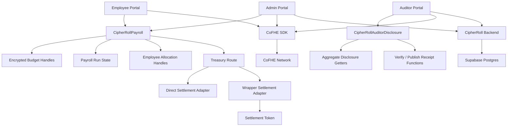

# CipherRoll

<div align="center">

## Private Payroll. Blind Execution.

**CipherRoll** is a confidential payroll system built on **Fhenix CoFHE** for **Arbitrum Sepolia**.

It combines **encrypted on-chain payroll state**, **real treasury-backed settlement**, **aggregate-only audit review**, and a **Wave 4 backend application layer** for reporting, notifications, exports, and operator support.

[Live App](https://cipher-roll.vercel.app/) · [Docs](https://cipher-roll.vercel.app/docs) · [Demo Video](https://youtu.be/uBAilNYfFIw)

</div>

---

## Highlights

- 🔐 **Encrypted payroll core:** salary amounts, budget state, committed payroll, and runway-sensitive values stay encrypted on-chain as CoFHE handles.
- 💸 **Real payout flow:** CipherRoll does not stop at bookkeeping. Payroll can move through treasury-backed settlement and reach a real employee payout path.
- 🧾 **Aggregate-only auditing:** auditors review organization-level summaries without receiving employee salary rows.
- 📡 **Wave 4 backend layer:** the frontend now runs with indexed backend summaries, status APIs, exports, notifications, and support-oriented APIs.
- 🧠 **In-product support:** CipherBot is live across docs and product portals to answer workflow and product questions in context.
- ☁️ **Hosted submission stack:** Vercel frontend, Render backend, and Supabase-backed Postgres persistence.

---

## What CipherRoll Solves

Traditional on-chain payroll leaks too much:

- salary amounts become inferable
- treasury posture becomes visible
- employee payout events become easy to link
- audit workflows often reveal more than they need to

CipherRoll is designed to keep the **financial core private** while staying honest about what still becomes public on the host chain.

### Private by design

- encrypted organization budget
- committed payroll
- remaining available budget / runway
- employee allocation amounts
- aggregate disclosure handles
- wrapper-backed confidential balances before request/finalize decryption

### Still public or inferable

- wallet addresses
- organization ids and submitted labels
- payroll-run states
- deadlines and timestamps
- claim / finalize transactions
- wrapper settlement amount once a `decryptForTx` proof is submitted on-chain

CipherRoll does **not** claim that all metadata disappears. It claims a narrower and more useful property: the **sensitive financial values stay encrypted**, while the product remains truthful about the public traces that still exist.

---

## Wave 4 Submission Snapshot

Wave 4 is the first real **application-platform** release on top of the confidential payroll core.

### Shipped in this submission

- ✅ confidential payroll workflow from workspace funding to employee claim
- ✅ explicit payroll-run lifecycle with funding and activation gates
- ✅ treasury-backed direct settlement path
- ✅ FHERC20 wrapper-backed payout path
- ✅ local employee decrypt and claim / finalize flow
- ✅ aggregate-only auditor permit review
- ✅ verify / publish audit receipts
- ✅ indexed backend reporting and export APIs
- ✅ workflow notifications and operational summaries
- ✅ shared SDK for runtime config, backend clients, and product types
- ✅ retrieval-backed CipherBot in docs and product portals
- ✅ hosted stack with durable backend persistence

### Why Wave 4 matters

Earlier waves proved the confidential payroll protocol and settlement path.  
Wave 4 proves that CipherRoll can behave like a **real product system**:

- the frontend no longer depends only on ad hoc contract inspection
- operators now have reporting and export surfaces
- admins and auditors now have indexed workflow context
- the hosted deployment behaves much closer to the local product

---

## Product Surfaces

CipherRoll currently ships the following user-facing routes:

| Surface | Route | Purpose |
| --- | --- | --- |
| Landing page | `/` | Product story and submission framing |
| Admin portal | `/admin` | Workspace setup, budget funding, payroll management, reporting, and auditor sharing |
| Employee portal | `/employee` | Local decrypt, payroll review, claim, and wrapper-finalize flow |
| Auditor portal | `/auditor` | Permit import, aggregate review, and audit receipt workflow |
| Docs | `/docs` | Product documentation, roadmap, reference, and support context |
| Tax status page | `/tax-authority` | Current scope boundary for future compliance-facing work |

---

## Core Workflow

### Admin flow

1. Connect admin wallet on **Arbitrum Sepolia**
2. Initialize **CoFHE**
3. Create workspace / organization
4. Fund encrypted organization budget
5. Configure treasury route
6. Create payroll run
7. Reserve treasury-backed run funding
8. Activate claims
9. Issue confidential allocations
10. Review summaries, notifications, and exports

### Employee flow

1. Connect employee wallet
2. Create or reuse local permit session
3. Review payroll allocations
4. Decrypt data locally in the browser
5. Claim payroll
6. Finalize wrapper-backed payout when the route requires it

### Auditor flow

1. Import admin-shared recipient permit payload
2. Activate permit locally
3. Review aggregate-only organization metrics
4. Decrypt only the allowed summary values
5. Generate verify or publish receipts when evidence is needed

---

## Architecture Overview



### Main building blocks

- **Contracts:** confidential payroll and auditor disclosure logic
- **Frontend:** admin, employee, auditor, docs, and tax-facing surfaces
- **Backend:** indexed read models, notifications, summaries, exports, and support APIs
- **Shared SDK:** runtime config, backend client, shared product types, and cross-surface helpers
- **Database:** Supabase-backed Postgres for hosted persistence

---

## Current Hosted Stack

| Layer | Current stack |
| --- | --- |
| Frontend hosting | **Vercel** |
| Backend hosting | **Render** |
| Backend persistence | **Supabase Postgres** |
| Chain target | **Arbitrum Sepolia** |
| Privacy execution | **Fhenix CoFHE** |
| Browser decrypt path | **`@cofhe/sdk`** |

This is important for the Wave 4 submission because CipherRoll is no longer a frontend-only delivery. The deployed product now depends on the frontend, backend, and database layers all being in place.

---

## Contracts and Deployment Values

Current **Arbitrum Sepolia** deployment:

| Contract | Address |
| --- | --- |
| `CipherRollPayroll` | `0xAeCaDDa189f35EfB69C2dCc37688030A9Af58DC3` |
| `CipherRollAuditorDisclosure` | `0x328Fe7B46ddf38888978C3f6CDC49233810ccE49` |
| `DirectSettlementAdapter` | `0x4d0EbdE132402145D464089Fd7bE7362dec6f428` |
| `WrapperSettlementAdapter` | `0x892DEaAaf13fb4a5a57288bB6089565c3cdB95e0` |

Deployment metadata:

- [outputs/arb-sepolia-deployment.json](./outputs/arb-sepolia-deployment.json)

---

## Local Development

### 1. Install dependencies

```bash
npm install
cd web
npm install
cd ..
```

### 2. Start the backend

```bash
npm run dev:backend
```

### 3. Start the web app

```bash
cd web
npm run dev
```

### 4. Useful quality checks

```bash
npm run compile
npm run test
npm run build:web
npm run build:backend
```

---

## Repository Guide

| Path | Purpose |
| --- | --- |
| `contracts/` | Core CipherRoll contracts and settlement adapters |
| `backend/` | Node.js backend service, indexer, API routes, and database layer |
| `packages/cipherroll-sdk/` | Shared runtime config, backend client, types, and helpers |
| `web/` | Next.js frontend for landing page, portals, docs, and CipherBot |
| `docs/` | Architecture, roadmap, testing, QA, privacy, and supporting references |
| `outputs/` | Deployment metadata and network output artifacts |

---

## Documentation Map

- [docs/ARCHITECTURE.md](./docs/ARCHITECTURE.md) — system design, backend layer, privacy boundaries, and hosted stack
- [docs/ROADMAP.md](./docs/ROADMAP.md) — wave-by-wave product progression and next planned work
- [docs/TESTING.md](./docs/TESTING.md) — verification flow for contracts, frontend, backend, and hosted submission behavior
- [docs/FRONTEND_MANUAL_QA.md](./docs/FRONTEND_MANUAL_QA.md) — frontend validation checklist
- [docs/PRIVACY_MATRIX.md](./docs/PRIVACY_MATRIX.md) — private vs public values and disclosure boundaries

---

## Scope Boundaries

### Shipped now

- confidential payroll
- treasury-backed settlement
- wrapper-backed payout flow
- aggregate-only auditor review
- audit receipts
- backend reporting and exports
- workflow notifications
- portal-integrated CipherBot

### Not yet a live product workflow

- full tax automation
- regulator-grade tax authority portal
- on-chain M-of-N governance
- multi-network rollout
- enterprise auth / role server model

---

## Why This Submission Is Strong

CipherRoll’s Wave 4 submission is not only a protocol demo and not only a UI demo.

It now demonstrates:

- **confidential value handling**
- **real payroll settlement**
- **truthful privacy framing**
- **auditor-safe selective disclosure**
- **backend-assisted operator visibility**
- **hosted full-stack deployment**

That combination is what makes the project feel like a serious confidential payroll product rather than a collection of isolated features.

