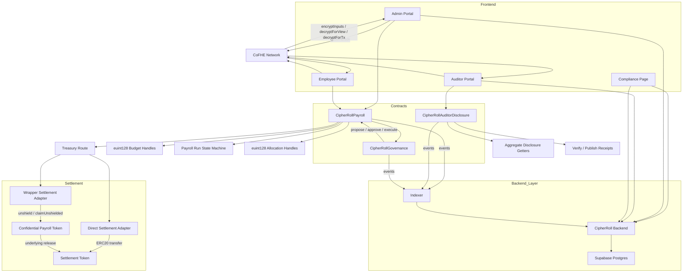
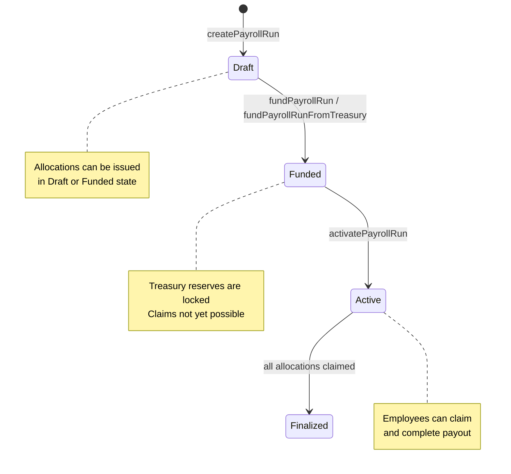
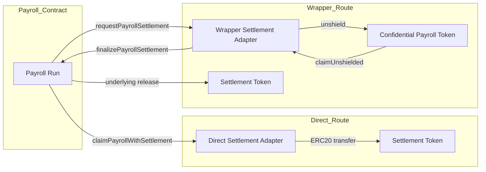
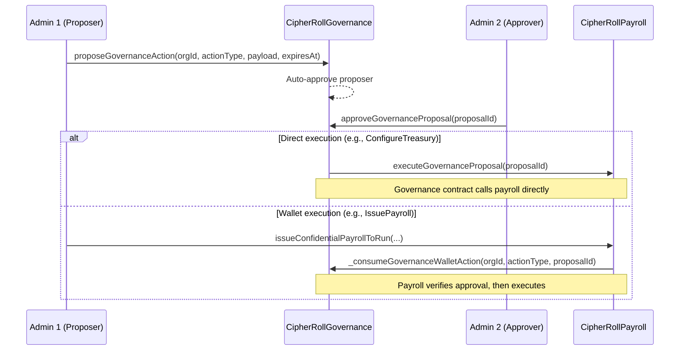
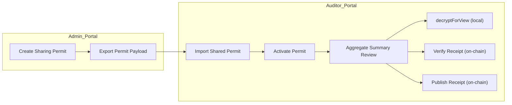
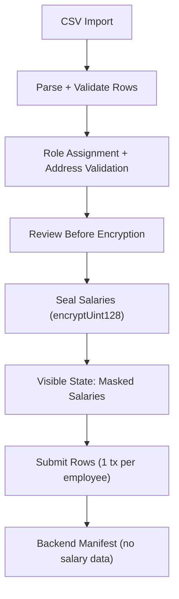
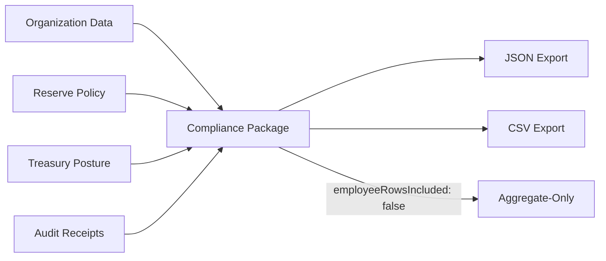
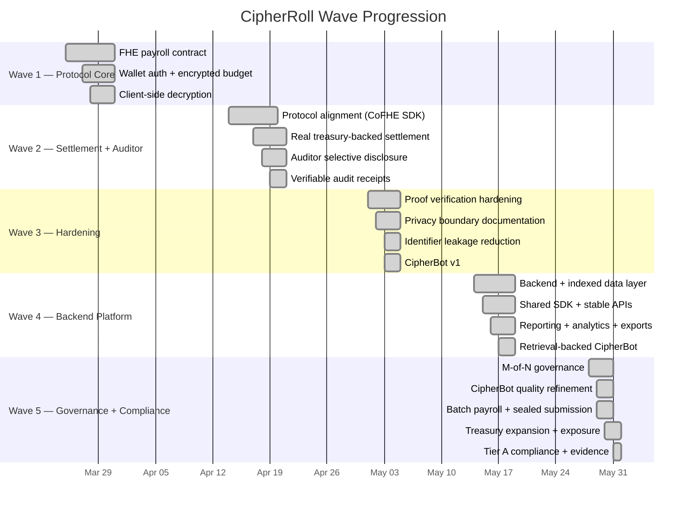

<div align="center">

# CipherRoll

### Private Payroll. Blind Execution.

**CipherRoll** is a full-stack confidential payroll system built on the **Fhenix CoFHE** coprocessor and deployed on **Arbitrum Sepolia**.

It combines **encrypted on-chain payroll state**, **real treasury-backed settlement** with direct and wrapper-backed payout paths, **M-of-N governance** for sensitive execution, **browser-local batch payroll**, **aggregate-only audit review** with verifiable on-chain receipts, **Tier A compliance exports**, and a **backend application layer** for reporting, notifications, exports, and operator support.

[](https://cipher-roll.vercel.app/)
[](https://cipher-roll.vercel.app/docs)
[](https://youtu.be/yeKGeHdbBsA)
[](https://sepolia-rollup.arbitrum.io/)
[](https://fhenix.io)

</div>

---

## Table of Contents

- [The Problem](#the-problem)
- [What CipherRoll Solves](#what-cipherroll-solves)
- [Architecture](#architecture)
- [Core Contract Surfaces](#core-contract-surfaces)
- [Payroll Lifecycle](#payroll-lifecycle)
- [Treasury Architecture](#treasury-architecture)
- [M-of-N Governance](#m-of-n-governance)
- [Auditor Architecture](#auditor-architecture)
- [Batch Payroll](#batch-payroll)
- [Compliance & Tax](#compliance--tax)
- [Privacy Boundary](#privacy-boundary)
- [Wave Progression](#wave-progression)
- [Product Surfaces](#product-surfaces)
- [Backend Layer](#backend-layer)
- [Shared SDK](#shared-sdk)
- [Deployment](#deployment)
- [Testing](#testing)
- [Local Development](#local-development)
- [Repository Guide](#repository-guide)
- [Scope Boundaries](#scope-boundaries)

---

## The Problem

Traditional on-chain payroll leaks too much. Once payroll moves to a transparent ledger:

- 🔓 **Salary amounts become inferable** — anyone watching can reconstruct compensation patterns
- 🔓 **Treasury posture becomes visible** — funding timing and reserve levels are public by default
- 🔓 **Payout events become linkable** — employee claim and settlement transactions are on-chain
- 🔓 **Audit workflows over-disclose** — review processes often reveal more than the compliance objective requires

CipherRoll keeps the **financial core private** while staying honest about what remains public on the host chain.

---

## What CipherRoll Solves

CipherRoll is a confidential payroll system where **sensitive financial values stay encrypted on-chain as FHE handles** while the product still supports a **complete payroll workflow** — from workspace creation through employee payout and audit evidence.

### 🔐 Encrypted Payroll Core

**Salary amounts**, **budget state**, **committed payroll**, and **runway** stay encrypted on-chain as `euint128` CoFHE handles. The contract performs **arithmetic over ciphertext** — the underlying integers are never exposed to host operators.

### 💸 Real Treasury-Backed Settlement

CipherRoll does not stop at encrypted bookkeeping. Payroll runs **reserve real treasury inventory** and settle through live payout paths:
- **Direct settlement** — immediate **ERC20 token release** to the employee
- **Wrapper-backed settlement** — confidential **FHERC20-style request/finalize unshield** flow that keeps balances encrypted before on-chain proof submission

### 🛡️ M-of-N Governed Execution

**Payroll issuance**, **vesting issuance**, **treasury route changes**, **governance membership**, and **quorum updates** route through **M-of-N governance proposals** with approval, revocation, expiration, and cancellation. **Operational actions** like creating runs, funding, and activating claims remain **single-admin** so the day-to-day workflow stays frictionless.

### 📦 Browser-Local Batch Payroll

**CSV import**, **row validation**, **review-before-encryption**, **salary sealing in the browser**, and **retryable one-transaction-per-row** submission. Backend manifests store only org id, run id, employee address, role, and tx hash — **never salary amounts**.

### 🧾 Aggregate-Only Audit Review

Auditors import a **shared permit** and review **organization-level summaries** — budget, committed payroll, available runway, run counts, treasury status — without unlocking **individual employee salary rows**. When view-only review is insufficient, CipherRoll upgrades shared aggregates into **verifiable or published on-chain receipts**.

### 📊 Tier A Compliance Exports

The compliance route produces **aggregate-first packages** with an **explicit tax reserve basis-point policy**, **treasury posture**, and **receipt metadata** — exportable as **JSON or CSV**. This is not a tax filing, not an authority integration, and not an employee salary export.

### 🧠 In-Product Copilot

**CipherBot** is a **retrieval-backed** product assistant live across docs and all four product portals. It answers workflow questions, explains **disclosure boundaries**, and helps operators troubleshoot common issues — **without taking autonomous actions**.

### ☁️ Hosted Full-Stack Deployment

**Vercel** frontend, **Render** backend, **Supabase-backed Postgres** persistence. The deployed product depends on **all three layers** being in place.

---

## Architecture



### Main Building Blocks

| Layer | Role |
| --- | --- |
| **Contracts** | **Confidential payroll logic**, **M-of-N governance**, **aggregate-only auditor disclosure**, and **settlement coordination** |
| **Frontend** | Admin, employee, auditor, compliance, and docs surfaces with **wallet-local decrypt** |
| **Backend** | **Chain indexer**, **read models**, **reporting APIs**, **treasury exposure**, **compliance packages**, **notifications**, **exports** |
| **Shared SDK** | **Runtime config**, **backend client**, **shared types**, **compliance helpers**, and **CipherBot knowledge base** |
| **Database** | **Supabase-backed Postgres** for **durable indexed persistence** |

---

## Core Contract Surfaces

### CipherRollPayroll

The core payroll contract handles the **complete confidential payroll lifecycle**:

**Write operations:**

| Function | Access | Governance-gated? |
| --- | --- | --- |
| `createOrganization` | Any | No |
| `configureOrganizationGovernanceExecutor` | **Primary admin** | No |
| `configureTreasury` | Admin | **Yes** — **direct execution** by governance contract |
| `depositBudget` | Admin | No |
| `createPayrollRun` | **Operational admin** | No |
| `fundPayrollRun` | Admin | No |
| `fundPayrollRunFromTreasury` | **Operational admin** | No |
| `activatePayrollRun` | **Operational admin** | No |
| `issueConfidentialPayroll` | Admin | **Yes** — **wallet execution** with governance check |
| `issueConfidentialPayrollToRun` | Admin | **Yes** — **wallet execution** with governance check |
| `issueVestingAllocation` | Admin | **Yes** — **wallet execution** with governance check |
| `issueVestingAllocationToRun` | Admin | **Yes** — **wallet execution** with governance check |
| `claimPayroll` | **Employee** | No |
| `claimPayrollWithSettlement` | **Employee** | No |
| `requestPayrollSettlement` | **Employee** | No |
| `finalizePayrollSettlement` | **Employee** | No |

**Encrypted state (`euint128`):**

| Value | Storage |
| --- | --- |
| Organization budget | `_encryptedBudget[orgId]` |
| Committed payroll | `_encryptedCommitted[orgId]` |
| Available runway | `_encryptedAvailable[orgId]` |
| Employee allocation amount | `_allocationAmounts[paymentId]` |

All encrypted values use the **`bytes32` ciphertext-handle model** and are operated on through **CoFHE coprocessor instructions** (`FHE.add`, `FHE.sub`, `FHE.gte`, `FHE.select`, `FHE.asEuint128`). The contract calls **`FHE.allowThis`** on every new encrypted value so it can perform subsequent operations, and **`FHE.allow(value, address)`** to grant decrypt access to the intended viewer.

### CipherRollAuditorDisclosure

A dedicated contract for **audit-safe reads** that **never exposes employee-level data**:

| Surface | What it returns |
| --- | --- |
| `getAuditorOrganizationSummary` | Treasury status, run counts, item counts, employee recipients, last issued/claimed timestamps — **all aggregate** |
| `getAuditorEncryptedSummaryHandles` | Three `euint128` handles: **budget, committed, available** — for **permit-backed** `decryptForView` |
| `verifyAuditorAggregateDisclosure` | Verifies a decrypt proof via **`FHE.verifyDecryptResult`**, emits an **on-chain receipt** |
| `publishAuditorAggregateDisclosure` | Verifies and calls **`FHE.publishDecryptResult`**, emits a **published receipt** |
| `verifyAuditorAggregateDisclosureBatch` | Batch verify for multiple aggregate metrics |
| `publishAuditorAggregateDisclosureBatch` | Batch publish for multiple aggregate metrics |

### CipherRollGovernance

**M-of-N governance** with **dual execution modes**:

| Mode | How it works | Used for |
| --- | --- | --- |
| **Direct execution** | Governance contract calls payroll directly via `executeGovernanceProposal` | `ConfigureTreasury` |
| **Wallet execution** | Admin calls payroll; payroll internally verifies governance approval via `_consumeGovernanceWalletAction` | `IssueConfidentialPayroll`, `IssueConfidentialPayrollToRun`, `IssueVestingAllocation`, `IssueVestingAllocationToRun` |

Each proposal has: **proposer auto-approval**, **multi-admin approval tracking**, **revocation**, **expiration** (`expiresAt`), and **cancellation** by proposer or primary admin. Execution requires `approvalCount >= quorum`.

---

## Payroll Lifecycle

CipherRoll models payroll as an **explicit state machine**, not a single-step action:



This sequencing matters because **claimability depends on successful treasury funding and explicit activation** — not on allocation issuance alone.

### Admin Flow

1. Connect admin wallet on **Arbitrum Sepolia**
2. Initialize **CoFHE** client and **enable secure view**
3. **Create workspace** / organization
4. **Fund encrypted organization budget** via `depositBudget`
5. **Configure treasury route** (direct or wrapper-backed) — **governed** if M-of-N is active
6. Optionally **bootstrap M-of-N governance** and add admins
7. **Create payroll run**
8. **Issue confidential allocations** — **governed** if M-of-N is active, or use **batch workspace** for CSV-driven issuance
9. **Reserve treasury-backed** run funding
10. **Activate claims**
11. Review **treasury exposure**, **notifications**, **compliance packages**, and **exports**

### Employee Flow

1. Connect employee wallet
2. Create or reuse **local permit session** via `@cofhe/sdk`
3. Review payroll allocations
4. **Decrypt amounts locally** in the browser via `decryptForView`
5. **Claim payroll**
6. **Finalize wrapper-backed payout** when the route requires it (`requestPayrollSettlement` → `finalizePayrollSettlement`)

### Auditor Flow

1. Import **admin-shared recipient permit** payload
2. **Activate permit** locally
3. Review **aggregate-only** organization metrics (budget, committed, available, run counts, treasury status)
4. **Decrypt only the allowed summary values**
5. Generate **verify or publish receipts** when on-chain evidence is needed

---

## Treasury Architecture

CipherRoll uses **treasury adapters** so payroll value comes from a **real token inventory**, not from implied contract-internal balances:



### Direct settlement

Useful when a workspace uses **standard ERC20 settlement** without requiring confidential balances at the payout step. The adapter **transfers tokens directly** to the employee upon verified claim.

### Wrapper-backed settlement

Useful when payroll should **stay confidential deeper into the payout path**. The adapter **shields ERC20 into a confidential payroll token**, then the employee initiates a **two-phase unshield flow**:

1. **`requestPayrollSettlement`** — creates a pending unshield request stored on-chain
2. **`finalizePayrollSettlement`** — submits a `decryptForTx` proof, the adapter calls `claimUnshielded`, and the underlying ERC20 is released

**Route-pinning safety:** Wrapper settlement requests are **pinned to the adapter that created them**. If the org's treasury route changes between request and finalize, the finalize **reverts** with `"CipherRoll: settlement route changed"`. This prevents **silent finalization against a different path**.

### Privacy note

Wrapper-backed confidential balances **stay private before the unshield request is decrypted**. Once a `decryptForTx` finalize proof is submitted on-chain, the finalized settlement amount **becomes public** — this is an **explicit disclosure event**, not a leak.

---

## M-of-N Governance

CipherRoll implements **dual-mode M-of-N governance** for sensitive actions while keeping day-to-day operations **single-admin**:



### Governed actions (require M-of-N approval)

| Action | Execution mode | What it controls |
| --- | --- | --- |
| `ConfigureTreasury` | Direct | Treasury route and adapter address |
| `IssueConfidentialPayroll` | Wallet | Standalone allocation issuance |
| `IssueConfidentialPayrollToRun` | Wallet | Run-scoped allocation issuance |
| `IssueVestingAllocation` | Wallet | Standalone vesting issuance |
| `IssueVestingAllocationToRun` | Wallet | Run-scoped vesting issuance |

### Operational actions (single-admin, no governance required)

- `createOrganization`
- `depositBudget`
- `createPayrollRun`
- `fundPayrollRun`
- `fundPayrollRunFromTreasury`
- `activatePayrollRun`

### Proposal lifecycle

Each proposal includes: proposer auto-approval, multi-admin approval tracking, approval revocation, expiration timestamp, and cancellation by proposer or primary admin. Execution requires `approvalCount >= quorum`.

---

## Auditor Architecture

CipherRoll's auditor model is **intentionally narrow** — auditors see **organization-level aggregates**, never employee salary rows:



### What auditors CAN see

- **Treasury configuration** and route health
- **Available and reserved** treasury funds
- Total / draft / funded / active / finalized **payroll run counts**
- Total / active / claimed / vesting **payroll item counts**
- **Employee recipient count** and last issued/claimed timestamps
- **Encrypted budget, committed, and available** handles (via `decryptForView`)
- **Audit receipt history**

### What auditors CANNOT see

- **Individual employee salary amounts**
- **Raw employee allocation handles**
- **Per-employee payment details**
- **Broad admin-only views**

### Evidence modes

| Mode | Function | Effect |
| --- | --- | --- |
| **View-only** | `decryptForView` | Plaintext stays local in the auditor's browser |
| **Verify receipt** | `verifyAuditorAggregateDisclosure` | `FHE.verifyDecryptResult` on-chain, emits receipt with `published: false` |
| **Publish receipt** | `publishAuditorAggregateDisclosure` | `FHE.publishDecryptResult` on-chain, emits receipt with `published: true` |
| **Batch verify** | `verifyAuditorAggregateDisclosureBatch` | Verify multiple metrics in one transaction |
| **Batch publish** | `publishAuditorAggregateDisclosureBatch` | Publish multiple metrics in one transaction |

---

## Batch Payroll

CipherRoll's batch payroll v1 keeps salary plaintext **browser-local** and **out of the backend**:



### How it works

1. **CSV import** — browser-local CSV parsing with **encoding detection** (UTF-8, UTF-16 LE/BE, BOM), **column auto-detection**
2. **Row validation** — employee address checks, **role assignment**, base salary mapping
3. **Review before encryption** — operators see all rows in plaintext before sealing
4. **Salary sealing** — each row's salary **encrypted with `encryptUint128`**, plaintext removed from visible state
5. **Retryable submission** — **one explicit wallet transaction per employee row**; confirmed rows are skipped on retry; failed rows can be resubmitted
6. **Safe manifests** — backend stores org id, run id, employee address, role slug, payment id, and tx hash — **never salary amounts**

### Scope constraint

Batch payroll v1 is available in **non-governed batch workspaces** only. Governed workspaces see an **explicit warning** and cannot seal or submit batch rows.

---

## Compliance & Tax

The `/tax-authority` surface provides **Tier A aggregate compliance** without exposing employee data:


### What compliance packages contain

- **Policy summary** — organization id, **reserve basis points**, generated timestamp
- **Tax provision** — estimated **aggregate reserve** calculated from `reservedTreasuryFunds × reserveBps / 10000`
- **Treasury posture** — route health, available/reserved inventory, pending claims
- **Evidence summary** — audit receipt counts and published status
- **Safety notes** — operational warnings and scope disclaimers

### What compliance packages do NOT contain

- **Individual employee salary rows** — `employeeRowsIncluded` is always `false`
- **Wallet-specific payment details**
- **Tax filing instructions** or authority integrations

### Export formats

- **JSON** — structured package via `/api/compliance/organizations/:orgId/package`
- **CSV** — flat export via `/api/compliance/organizations/:orgId/export?format=csv`

---

## Privacy Boundary

CipherRoll does **not** claim that all metadata disappears. It claims a narrower and more useful property: **the sensitive financial values stay encrypted**, while the product remains **truthful about the public traces** that still exist on the host chain.

### 🔒 Kept encrypted on-chain (`euint128`)

| Value | How |
| --- | --- |
| Organization budget | Stored as `euint128` handle, **permit-backed decrypt only** |
| Committed payroll | Stored as `euint128` handle, **permit-backed decrypt only** |
| Available runway | Stored as `euint128` handle, **permit-backed decrypt only** |
| Employee allocation amounts | Stored as `euint128` handle, **employee-only decrypt** |
| Auditor aggregate handles | Stored as `euint128`, **shared permit decrypt only** |
| Wrapper-backed confidential balances | **Encrypted until unshield request is finalized** |

### 🔓 Public by Arbitrum/EVM design

- **Transaction sender, recipient, nonce, tx hash**, gas usage, block number, timestamp
- **Contract calldata** for all write functions
- **Event logs** and indexed topics
- **ERC20 transfer events** and final payout token balances
- **Wrapper settlement amount** after `decryptForTx` finalize proof submission

### 🔓 Public because CipherRoll emits it explicitly

- `orgId`, **admin address**, **treasury adapter address**, treasury route id, timestamps
- `paymentId`, **employee address**, memo hash, **vesting flags** and timestamps
- `payrollRunId`, **funding deadline**, **run status**, allocation and claimed counts
- **Organization insights** (total/active/claimed/vesting items, recipient counts)
- **Settlement request metadata** (`requestId`, payout asset, existence flag)

### 🔍 Inferable from predictable inputs

- **Workspace ids** when operators use mnemonic labels (mitigated by **high-entropy alternatives**)
- **Treasury route ids** from readable labels
- **Payment ids** (now generated with **high-entropy helpers**)

> **CipherRoll's value is not "hide everything." Its value is "keep the financially sensitive core encrypted while staying honest about the public edges."**

---

## Wave Progression

CipherRoll was built across **five waves of increasing scope**. Each wave proved a specific capability before later waves built on top of it:



| Wave | Scope | What it proved |
| --- | --- | --- |
| **Wave 1** | **Core FHE protocol** | Encrypted payroll state, homomorphic budgeting, client-side decrypt |
| **Wave 2** | **Settlement + auditor** | Real treasury-backed payout paths, auditor selective disclosure, verifiable receipts |
| **Wave 3** | **Submission hardening** | Proof verification, truthful privacy framing, identifier leakage reduction, CipherBot v1 |
| **Wave 4** | **Backend platform** | Indexed read models, shared SDK, reporting/notifications/exports, retrieval-backed CipherBot |
| **Wave 5** | **Governance + compliance** | M-of-N governance, batch payroll, treasury exposure, Tier A compliance packages |

---

## Product Surfaces

CipherRoll ships six user-facing routes:

| Surface | Route | Purpose |
| --- | --- | --- |
| 🏠 Landing page | `/` | Product story, Wave 5 updates, and portal navigation |
| 🛡️ Admin portal | `/admin` | **Workspace creation**, **encrypted budget funding**, **payroll lifecycle**, **M-of-N governance**, **batch payroll**, **treasury exposure**, reporting, **auditor permit sharing**, and exports |
| 👤 Employee portal | `/employee` | **Local decrypt**, payroll review, **claim**, and **wrapper-finalize** flow |
| 🔍 Auditor portal | `/auditor` | **Shared permit import**, **aggregate-only review**, and **verify/publish receipt** generation |
| 📄 Docs | `/docs` | Architecture, workflows, privacy, contracts, API reference, roadmap, and troubleshooting |
| 🏛️ Compliance page | `/tax-authority` | **Tier A aggregate compliance** package, **tax reserve policy**, and **receipt evidence export** (JSON/CSV) |

All four product portals include **CipherBot integration** scoped to the relevant workflow context.

---

## Backend Layer

The backend is an intentionally **read-model and operator-support layer**. It **does not replace browser-local decrypt flows** and **does not centralize employee salary plaintext**.

### API routes (18 GET + 3 POST)

| Category | Routes |
| --- | --- |
| **Platform** | `GET /api/health`, `GET /api/status` |
| **Organizations** | `GET /api/organizations`, `GET /api/organizations/:orgId` |
| **Payroll runs** | `GET /api/organizations/:orgId/runs`, `GET /api/payroll-runs/:runId` |
| **Payments** | `GET /api/organizations/:orgId/payments`, `GET /api/payments/:paymentId` |
| **Batch manifests** | `GET /api/organizations/:orgId/batch-payroll-manifests`, `POST /api/batch-payroll-manifests` |
| **Audit receipts** | `GET /api/audit-receipts` |
| **Events** | `GET /api/events` |
| **Notifications** | `GET /api/notifications` (filter by org, category, severity) |
| **Reporting** | `GET /api/reports/organizations/:orgId/summary`, `GET /api/reports/organizations/:orgId/treasury`, `GET /api/reports/organizations/:orgId/audit-package`, `GET /api/reports/organizations/:orgId/export` |
| **Compliance** | `GET /api/compliance/organizations/:orgId/package`, `GET /api/compliance/organizations/:orgId/export` |
| **CipherBot** | `POST /api/cipherbot/query` |
| **Admin** | `POST /api/admin/reindex` |

### Indexer

The backend indexer **polls on a configurable interval** (default 30s) and **processes events from all three contracts** (payroll, auditor disclosure, governance). It uses **chunk-based block scanning**, refreshes on-chain state after each event, upserts to the database, and generates **workflow notifications** with category and severity.

### Database tables

**Auto-migrated on startup** using `CREATE TABLE IF NOT EXISTS`:

`metadata` · `organizations` · `organization_insights` · `treasury_routes` · `payroll_runs` · `payments` · `audit_receipts` · `raw_events` · `notifications` · `batch_payroll_manifests`

---

## Shared SDK

`packages/cipherroll-sdk/` **prevents frontend-backend drift** with seven modules:

| Module | What it provides |
| --- | --- |
| **`runtime`** | **Chain config**, environment-based runtime config, **label generation helpers**, address validation |
| **`frontend-types`** | **18 types** for contract views, permits, auditor summaries, payroll runs, and settlement requests |
| **`backend-types`** | **18 types** for indexer records, report summaries, treasury exposure, compliance packages, and notifications |
| **`contract-views`** | **Mappers** from raw contract return values to typed frontend views |
| **`backend-client`** | `CipherRollBackendClient` with **20 methods** for all backend API routes |
| **`cipherbot`** | **Knowledge base with 24 entries**, relevance scoring, scope-aware starter questions, and answer composition |
| **`compliance`** | **Tax reserve BPS normalization**, aggregate reserve calculation, and policy label formatting |

---

## Deployment

### Current Arbitrum Sepolia deployment

| Contract | Address |
| --- | --- |
| `CipherRollPayroll` | [`0x65EAd53436C9cA1e04F2ba87E8e155f2D13b9bd1`](https://sepolia.arbiscan.io/address/0x65EAd53436C9cA1e04F2ba87E8e155f2D13b9bd1) |
| `CipherRollGovernance` | [`0x6D0F888dB3568A2fEa59d581b521Bb51836268C8`](https://sepolia.arbiscan.io/address/0x6D0F888dB3568A2fEa59d581b521Bb51836268C8) |
| `CipherRollAuditorDisclosure` | [`0x1473A16f08e157d055599E3A223c50e2c4793369`](https://sepolia.arbiscan.io/address/0x1473A16f08e157d055599E3A223c50e2c4793369) |
| `DirectSettlementAdapter` | [`0xBcF43888A0A1B80777356bBca13425449Aad142c`](https://sepolia.arbiscan.io/address/0xBcF43888A0A1B80777356bBca13425449Aad142c) |
| `WrapperSettlementAdapter` | [`0x51C95fBE788e1AE6f82196692f648910256a9793`](https://sepolia.arbiscan.io/address/0x51C95fBE788e1AE6f82196692f648910256a9793) |
| `ConfidentialPayrollToken` | [`0x917CAD297690E5408bcda9b44Cc65F962403F200`](https://sepolia.arbiscan.io/address/0x917CAD297690E5408bcda9b44Cc65F962403F200) |
| `SettlementToken` | [`0x137Ea684F332e50BE9DD91269604022FB724CddA`](https://sepolia.arbiscan.io/address/0x137Ea684F332e50BE9DD91269604022FB724CddA) |

Full deployment metadata: [outputs/arb-sepolia-deployment.json](./outputs/arb-sepolia-deployment.json)

### Hosted stack

| Layer | Stack |
| --- | --- |
| Frontend | **Vercel** |
| Backend | **Render** |
| Database | **Supabase Postgres** |
| Chain | **Arbitrum Sepolia** |
| Privacy execution | **Fhenix CoFHE** |
| Browser decrypt | **`@cofhe/sdk`** |

### Settlement adapter architecture decision

The deployed settlement adapters use **CoFHE-aligned custom implementations** (`MockSettlementTreasuryAdapter`, `MockFHERC20SettlementTreasuryAdapter`) that follow the same **`ITreasuryAdapter` interface** and confidentiality model. **Judge confirmation** established that a technically correct, CoFHE-aligned custom confidential token wrapper is acceptable. **Strict migration to the official FHERC20 contract surface is not required for evaluation**.

---

## Testing

### Contract integration tests

| File | Lines | Coverage |
| --- | --- | --- |
| `test/CipherRollPayroll.spec.ts` | 1621 | Encrypted budget math, payroll issuance, employee-only decrypt, zero-allocation on budget exceed, permit-backed decrypt, vesting enforcement, vesting metadata, organization insights, auditor aggregate summaries, shared-permit decrypt, verify/publish receipts, batched receipts, payroll run lifecycle (Draft→Funded→Active→Finalized), direct settlement, treasury budget cap, wrapper settlement, route pinning, fractional wrapper amounts, wrong plaintext rejection, mismatched request rejection, replayed finalize rejection, no-pending-request rejection, invalid admin actions, M-of-N governance proposal/approval/execution, approval revocation, quorum enforcement, claim failures |
| `test/cipherbot.spec.ts` | 69 | CipherBot knowledge base: pending-claim troubleshooting, governance vs permit boundary, compliance package descriptions |
| `test/compliance.spec.ts` | 29 | Tax reserve BPS normalization, aggregate reserve calculation, policy label formatting |
| `test/adminPortalUtils.spec.ts` | 38 | Decimal-to-wei parsing, malformed amount rejection, contract error message mapping, tx hash formatting |

### Quality baseline

```bash
npm run compile      # Solidity compilation
npm run test         # All test suites
npm run build:web    # Frontend production build
npm run build:backend # Backend TypeScript build
```

All four must pass cleanly before the submission is considered valid.

---

## Local Development

### 1. Install dependencies

```bash
npm install
cd web && npm install && cd ..
```

### 2. Configure environment

```bash
cp .env.example .env
# Edit .env with your chain RPC, contract addresses, backend URL, and database URL
```

### 3. Start the backend

```bash
npm run dev:backend
```

### 4. Start the web app

```bash
cd web && npm run dev
```

### 5. Verify the baseline

```bash
npm run compile && npm run test && npm run build:web && npm run build:backend
```

---

## Repository Guide

| Path | Purpose |
| --- | --- |
| `contracts/` | Core CipherRoll contracts, governance, auditor disclosure, and settlement adapters |
| `backend/` | Node.js backend service: indexer, API routes, database layer, and CipherBot endpoint |
| `packages/cipherroll-sdk/` | Shared runtime config, backend client, product types, compliance helpers, and CipherBot knowledge |
| `web/` | Next.js frontend for landing page, portals, docs, and CipherBot widget |
| `docs/` | Architecture, roadmap, testing, QA, privacy matrix, and supporting references |
| `outputs/` | Deployment metadata and network artifacts |
| `test/` | Contract integration, CipherBot, compliance, and admin utility tests |

---

## Scope Boundaries

### ✅ Shipped in this submission

- **Confidential payroll workflow** from workspace creation to employee payout
- **Explicit payroll-run lifecycle** (Draft → Funded → Active → Finalized)
- **Treasury-backed direct and wrapper-backed settlement** paths
- **Local employee decrypt**, claim, and finalize flow
- **Aggregate-only auditor permit review**
- **Verify and publish on-chain audit receipts** (single and batch)
- **M-of-N governance** for sensitive admin actions with dual execution modes
- **Browser-local batch payroll** with sealed salaries and retryable submission
- **Treasury exposure reporting** with route health and payout backlog
- **Tier A aggregate compliance packages** and JSON/CSV exports
- **Indexed backend** with reporting, notification, and export APIs
- **Shared SDK** with runtime config, backend client, and product types
- **Retrieval-backed CipherBot** across docs and all product portals
- **Hosted full-stack deployment** (Vercel + Render + Supabase)

### ⏳ Intentionally deferred

- **Full tax automation** and real tax authority integrations
- **Multi-jurisdiction tax modeling**
- **Multi-network rollout**
- **Enterprise auth / role server model**
- **Action-taking AI assistants**

---

<div align="center">

**CipherRoll — Private Payroll. Blind Execution.**

Final Wave 5 submission · Confidential payroll infrastructure for Arbitrum Sepolia · Built on Fhenix CoFHE

</div>
