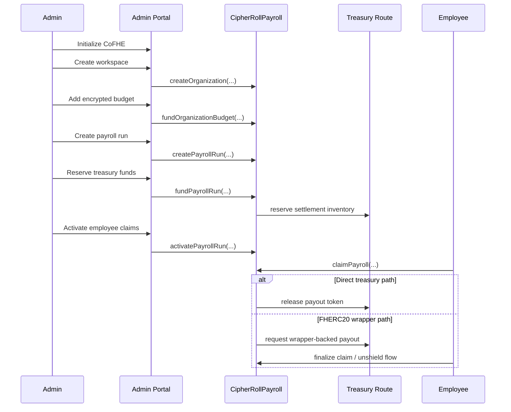
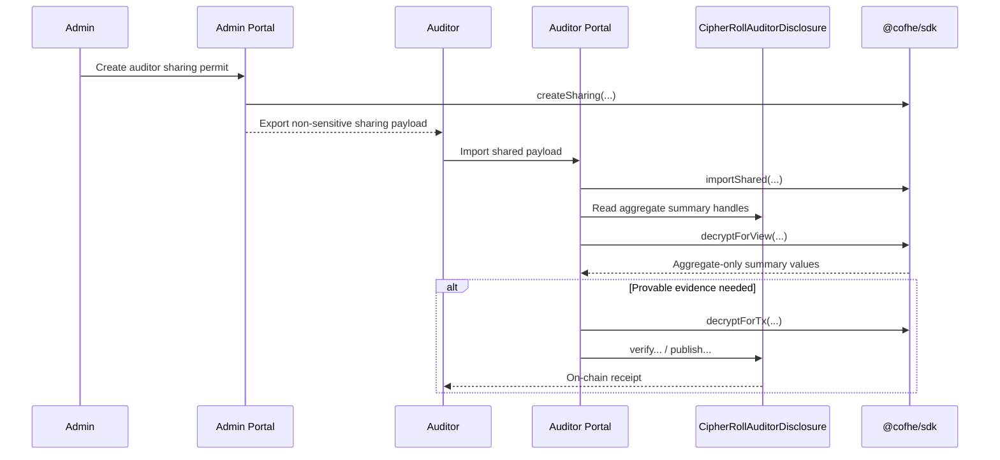

# CipherRoll

<div align="center">
  <h3>Private Payroll. Real Settlement.</h3>
  <p>Confidential payroll infrastructure on Arbitrum Sepolia using Fhenix CoFHE and FHERC20 settlement primitives.</p>

  <p>
    <a href="https://cipher-roll.vercel.app/">Live App</a>
    ·
    <a href="https://cipher-roll.vercel.app/docs">Docs</a>
    ·
    <a href="https://youtu.be/uBAilNYfFIw">Demo Video</a>
  </p>
</div>

---

## Overview

CipherRoll is a confidential payroll system built on the official Fhenix CoFHE stack for **Arbitrum Sepolia**.

Instead of writing salaries, payroll balances, and payroll commitments to a transparent ledger, CipherRoll keeps those values encrypted on-chain as FHE handles. Admins can create a workspace, fund encrypted payroll budgets, create explicit payroll runs, reserve treasury inventory, activate claimability, and let employees complete payout from their own wallet.

Wave 2 extends CipherRoll from encrypted bookkeeping into a **real settlement system** with:

- treasury-backed payroll funding
- explicit payroll-run lifecycle management
- direct treasury payout support
- official FHERC20 wrapper-backed payout flow
- employee local decrypt + claim/finalize flow
- aggregate-only auditor permit review
- verifiable and publishable audit receipts

---

## Why CipherRoll

Payroll is one of the most sensitive workflows inside any company, but traditional on-chain payment systems leak too much:

- salary amounts become inferable from transfers
- treasury timing and runway become visible
- employee compensation events become linkable to wallets
- audit and compliance workflows often reveal more than necessary

CipherRoll is designed to solve that problem with a practical privacy boundary:

- **Private:** salary allocations, budget summaries, payroll commitments, aggregate runway values, wrapper-backed confidential balances before final claim
- **Public:** wallet addresses involved in transactions, organization ids, payroll-run states, funding deadlines, claim/finalization txs, and final unshielded payout amounts when wrapper settlement is claimed

The goal is not to claim that “everything is hidden.” The goal is to keep the sensitive financial core encrypted while remaining honest about what the host chain still exposes.

---

## What Wave 2 Ships

### 1. Real payroll settlement

CipherRoll no longer stops at allocation tracking. A funded payroll run can now settle into a real payout path.

### 2. Explicit payroll lifecycle

Payroll is modeled as a real workflow, not a vague “payroll action”:

1. Create workspace
2. Add encrypted budget
3. Create payroll run
4. Reserve treasury funds
5. Activate employee claims
6. Employee claims
7. Employee finalizes payout if wrapper-backed settlement is used

### 3. FHERC20 wrapper path

The preferred Phase 2 settlement path uses the official FHERC20 wrapper model so payroll can remain confidential deeper into the payout lifecycle.

### 4. Aggregate-only auditor review

Auditors do not receive employee salary rows. They receive only aggregate organization-level review data through shared permits.

### 5. Verifiable audit receipts

Auditors can move from “viewable” to “provable” by generating on-chain verify or publish receipts for one selected metric or a selected batch of metrics.

---

## Product Surface

CipherRoll currently ships these user-facing surfaces:

- **Landing page**
- **Admin portal**
- **Employee portal**
- **Auditor portal**
- **Tax status page**
- **Docs page**

The active supported frontend/network target is:

- **Arbitrum Sepolia only**

---

## System Architecture

```mermaid
flowchart TD
    A[Admin Wallet] --> B[Admin Portal]
    E[Employee Wallet] --> F[Employee Portal]
    U[Auditor Wallet] --> G[Auditor Portal]

    B --> C[CipherRollPayroll]
    G --> D[CipherRollAuditorDisclosure]
    F --> C

    C --> H[Encrypted Budget Handles]
    C --> I[Payroll Run State]
    C --> J[Treasury Route]
    C --> K[Employee Allocation Handles]

    D --> L[Aggregate Auditor Getters]
    D --> M[Audit Receipt Functions]

    B --> N[@cofhe/sdk]
    F --> N
    G --> N

    N --> O[CoFHE Network]
    J --> P[Direct Treasury Adapter]
    J --> Q[FHERC20 Wrapper Adapter]
    Q --> R[Settlement Token]
```

---

## Payroll Lifecycle



---

## Auditor Disclosure Flow



---

## Core Contracts

Wave 2 deployment on **Arbitrum Sepolia (chain id 421614)**:

| Contract | Address | Explorer |
| --- | --- | --- |
| CipherRollPayroll | `0x387E9B1c6464A68243CaeB498d58C1dc4Bc096d2` | [Arbiscan](https://sepolia.arbiscan.io/address/0x387E9B1c6464A68243CaeB498d58C1dc4Bc096d2) |
| CipherRollAuditorDisclosure | `0xe202F82b6F897e16A298C970E94b525B8B888550` | [Arbiscan](https://sepolia.arbiscan.io/address/0xe202F82b6F897e16A298C970E94b525B8B888550) |
| MockSettlementToken | `0xdFaa338653731E8b55f2Bf02584B7e1762256512` | [Arbiscan](https://sepolia.arbiscan.io/address/0xdFaa338653731E8b55f2Bf02584B7e1762256512) |
| DirectSettlementAdapter | `0x7C439fC47d13221cDDF9f1956c7fbeEc2840C4D0` | [Arbiscan](https://sepolia.arbiscan.io/address/0x7C439fC47d13221cDDF9f1956c7fbeEc2840C4D0) |
| MockConfidentialPayrollToken | `0x87b2C4C8d33e08B16ee6fAE06d4b0625d8E76EE4` | [Arbiscan](https://sepolia.arbiscan.io/address/0x87b2C4C8d33e08B16ee6fAE06d4b0625d8E76EE4) |
| WrapperSettlementAdapter | `0x808B62EEEa65611B39DB1614A389b2796680ea3e` | [Arbiscan](https://sepolia.arbiscan.io/address/0x808B62EEEa65611B39DB1614A389b2796680ea3e) |

Deployment artifact:

- [outputs/arb-sepolia-deployment.json](./outputs/arb-sepolia-deployment.json)

---

## Contract Responsibilities

### `CipherRollPayroll`

Main protocol contract responsible for:

- organization/workspace creation
- encrypted budget funding
- payroll-run lifecycle
- employee allocation issuance
- treasury route integration
- employee claim path
- wrapper-backed and direct-settlement orchestration

### `CipherRollAuditorDisclosure`

Auditor-specific contract surface responsible for:

- aggregate-only disclosure getters
- compliance-safe organization summaries
- one-metric receipt verification/publish flow
- batched receipt verification/publish flow

### Treasury adapters

CipherRoll supports:

- **Direct treasury settlement adapter**
- **FHERC20 wrapper-backed settlement adapter**

The wrapper path is the preferred Wave 2 settlement route.

---

## Privacy Boundary

### Private by default

The following values are intended to remain confidential:

- organization encrypted budget
- committed payroll amount
- available runway amount
- employee allocation amounts
- aggregate auditor summary handles
- confidential balances prior to wrapper unshield finalization

### Public on the host chain

The following are still public or inferable:

- admin, employee, and auditor wallet addresses
- organization ids and labels used by the app
- payroll-run state transitions
- funding deadlines and timestamps
- claim/finalization transaction activity
- final underlying amount revealed at wrapper unshield claim time

### Auditor boundary

Auditors can review only:

- aggregate budget
- aggregate committed payroll
- aggregate available runway
- counts and compliance-safe org summary fields

Auditors **cannot** review:

- employee salary rows
- raw employee allocation handles
- admin-only salary getters
- unnecessary PII

---

## Frontend User Flows

### Admin flow

1. Connect admin wallet
2. Initialize CoFHE
3. Create workspace
4. Add encrypted budget
5. Configure treasury route
6. Create payroll run
7. Reserve treasury funds
8. Activate employee claims
9. Optionally create auditor sharing permit

### Employee flow

1. Connect employee wallet
2. Enable privacy mode
3. Refresh payroll
4. Decrypt allocation locally in browser
5. Claim payroll
6. Finalize payout if wrapper-backed settlement is active

### Auditor flow

1. Connect auditor wallet
2. Enable auditor access
3. Import shared permit payload
4. Review aggregate-only disclosures
5. Optionally create verify/publish audit receipts

---

## Repository Layout

```text
CipherRoll/
├── contracts/                 # Solidity contracts
├── scripts/                   # Deploy and smoke scripts
├── test/                      # Hardhat contract tests
├── outputs/                   # Deployment artifacts and smoke outputs
├── docs/                      # Architecture, roadmap, QA, testing docs
├── web/                       # Next.js frontend
│   ├── app/                   # App router pages
│   ├── components/            # UI components
│   └── lib/                   # Client + permit helpers
└── README.md
```

---

## Local Development

### Requirements

- Node.js 20+
- npm
- Arbitrum Sepolia RPC endpoint
- funded deployer/admin wallet for testnet actions

### Install

```bash
npm install
cd web
npm install
```

### Environment

Create your root and frontend env files as needed.

Typical values used by the project include:

- Arbitrum Sepolia RPC URL
- deployer private key
- frontend contract address / chain config

### Run frontend

```bash
cd web
npm run dev
```

### Build frontend

```bash
cd web
npm run build
```

---

## Smart Contract Commands

### Compile

```bash
npm run compile
```

### Run tests

```bash
npm test
```

### Deploy to Arbitrum Sepolia

```bash
npm run deploy:arb-sepolia
```

### Live wrapper smoke

```bash
npm run smoke:arb-sepolia:wrapper
```

---

## Testing and QA

Detailed guides live here:

- [docs/ARCHITECTURE.md](./docs/ARCHITECTURE.md)
- [docs/TESTING.md](./docs/TESTING.md)
- [docs/FRONTEND_MANUAL_QA.md](./docs/FRONTEND_MANUAL_QA.md)
- [docs/ROADMAP.md](./docs/ROADMAP.md)
- [CHECKLIST.md](./CHECKLIST.md)

Wave 2 verification includes:

- payroll-run lifecycle checks
- treasury-backed funding and activation gating
- employee claim + finalize payout checks
- FHERC20 wrapper settlement smoke
- shared-permit auditor review
- verify/publish single-metric receipts
- verify/publish batched receipts

---

## Frontend Deployment

The live frontend is deployed on Vercel:

- **Live app:** https://cipher-roll.vercel.app/

The active frontend build target is:

- **Arbitrum Sepolia only**

If you deploy your own instance, ensure:

- the Vercel project root points to `web/`
- build command is `npm run build`
- install command is `npm install`
- environment variables match the current Arbitrum Sepolia deployment

---

## Innovation Summary

CipherRoll’s Wave 2 contribution is not just “private payroll” in the abstract. It combines:

- CoFHE-native encrypted payroll accounting
- explicit treasury-backed settlement
- official FHERC20 wrapper payout integration
- employee-local decrypts
- aggregate-only selective disclosure for auditors
- verifiable audit receipts for compliance evidence

This moves the product from a concept demo into a much more complete operational prototype.

---

## Current Limitations

CipherRoll is still a buildathon-stage system and should be described honestly:

- active target is Arbitrum Sepolia only
- deployed assets are testnet assets
- tax authority portal is still status-oriented, not a full compliance workflow
- wrapper-backed final payout amounts become public at final unshield claim time
- local/browser permit revocation is a session-level aid, not a universal remote revoke

---

## References

- [Fhenix](https://www.fhenix.io/)
- [CoFHE docs](https://docs.fhenix.zone/)
- [Wave 2 roadmap](./docs/ROADMAP.md)
- [Architecture notes](./docs/ARCHITECTURE.md)

---

## Demo

- **Live App:** https://cipher-roll.vercel.app/
- **Docs:** https://cipher-roll.vercel.app/docs
- **Video Demo:** https://youtu.be/uBAilNYfFIw

---

Built for the Fhenix Buildathon on **Arbitrum Sepolia**.
