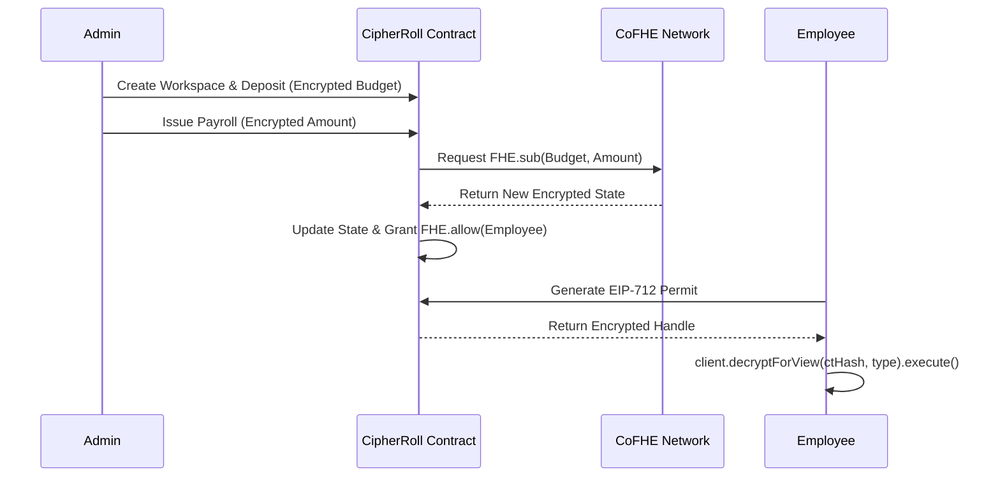

# CipherRoll 

<div align="center">
  <h3>Private Payroll. Blind Execution.</h3>
  <p>Confidential payroll infrastructure for Arbitrum Sepolia and Base Sepolia.</p>
</div>

---

**[🌐 Live Application](https://cipher-roll.vercel.app/)** | **[📚 Official Documentation](https://cipher-roll.vercel.app/docs)** | **[🎥 Video Demo](https://youtu.be/HryZFOa2eUY)**

---

## 🔒 What is CipherRoll?

CipherRoll is a confidential payroll application built for the latest official **CoFHE (Coprocessor for Fully Homomorphic Encryption)** workflow on **Arbitrum Sepolia** and **Base Sepolia**.

CipherRoll eliminates the need for transparent ledgers or clunky off-chain ZK provers. Instead, organizations deposit funds and issue payroll salaries into **mathematically encrypted states**. The host chain (EVM) computes the additions and subtractions natively over these ciphertexts without ever decrypting the underlying values.

## ✨ Core Features

- **True Confidentiality:** Salary amounts and budget summaries remain hidden on-chain.
- **Blind Computation:** EVM nodes execute payroll logic (`FHE.add`, `FHE.sub`) natively on ciphertexts.
- **Zero Syncing:** Legacy privacy networks required downloading thousands of UTXOs. CipherRoll uses purely synchronized global FHE state.
- **Client-Side Permit-Backed Decryption:** Employees decrypt their specific allocations directly in the browser via `@cofhe/sdk` using `decryptForView()`, without relying on trusted backend proxies.
- **Explicit SDK Workflow:** CipherRoll encrypts inputs with `encryptInputs()` and is positioned to extend selective-disclosure flows with `decryptForTx()`.
- **EIP-712 Permit Scoping:** Encrypted state access is safeguarded by cryptographically secure permits verified inside the CoFHE TaskManager.

## 🏗️ Architecture Flow



## 🚀 Quick Setup

1. **Install Dependencies**
   ```bash
   npm install
   cd web && npm install
   ```

2. **Environment Configuration**
   ```bash
   cp .env.example .env
   # Ensure your Arbitrum Sepolia or Base Sepolia RPC and keys are configured
   ```

3. **Smart Contract Deployment**
   ```bash
   npm run compile
   npm run deploy:arb-sepolia
   ```

4. **Verify the Engineering Baseline**
   ```bash
   npm run baseline
   ```

5. **Launch Application**
   ```bash
   cd web
   npm run dev
   ```

## 📚 Technical Documentation

- [System Architecture](./docs/ARCHITECTURE.md)
- [Product Roadmap](./docs/ROADMAP.md)
- [Testing & QA](./docs/TESTING.md)
- [Frontend QA Guide](./docs/FRONTEND_MANUAL_QA.md)

## 🛡️ Security Model

CipherRoll leverages `@fhenixprotocol/cofhe-contracts` to handle operational lifecycles on Arbitrum Sepolia and Base Sepolia. We ensure that **"Blind Computation"** protects your organization's financial strength from malicious validators, metadata leakage, and unauthorized handle scraping via open RPCs.

---
*Built during the Fhenix Buildathon using the CoFHE stack on Arbitrum Sepolia and Base Sepolia.*
