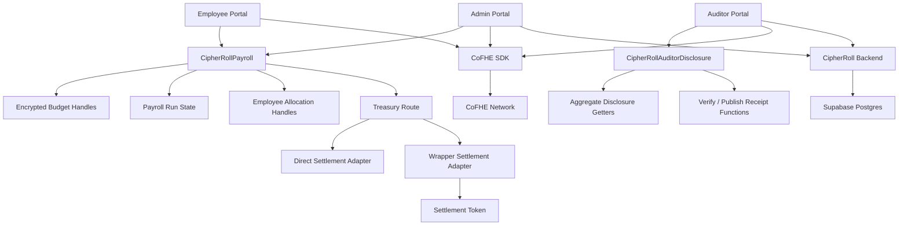
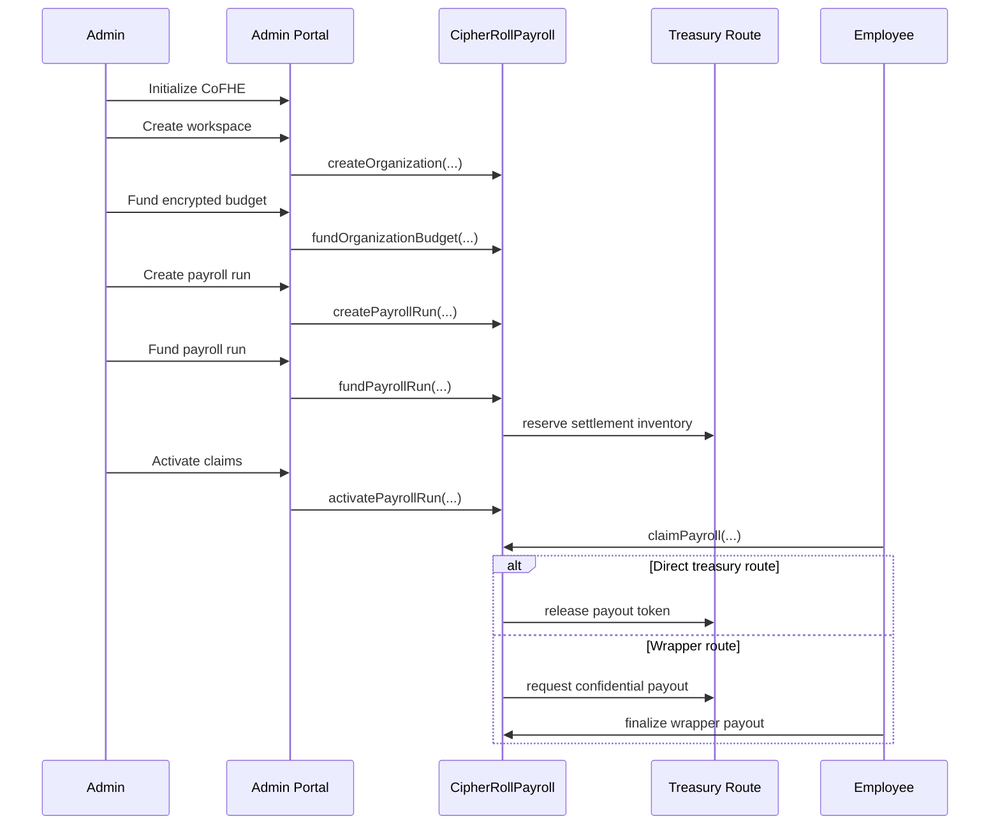

# CipherRoll Architecture

## 1. System Intent

CipherRoll is a confidential payroll system built on **Fhenix CoFHE** and deployed for **Arbitrum Sepolia**.

Its architectural goal is simple:

- keep sensitive payroll values encrypted on-chain
- still support a real payroll workflow
- let employees receive real payouts
- let auditors review only aggregate disclosures
- govern sensitive execution without turning every operational step into a multisig bottleneck
- support batch payroll and Tier A compliance packaging without centralizing salary plaintext
- give operators a useful backend-assisted product layer without centralizing payroll plaintext

Wave 5 is the final verified product wave for this roadmap. CipherRoll now includes a backend service, indexed read models, notification and export APIs, treasury exposure reports, safe batch manifests, Tier A compliance packages, a shared SDK, and hosted persistence.

---

## 2. High-Level Architecture

---

## 3. Major Layers

### 3.1 Contracts

The contract layer handles:

- workspace / organization creation
- encrypted budget state
- payroll-run lifecycle
- employee allocation issuance
- M-of-N governed execution for sensitive actions
- settlement route coordination
- employee claims
- auditor-safe aggregate disclosures
- verify / publish receipt flows

The contract layer is where the confidential payroll logic lives. Sensitive numbers are represented as encrypted handles rather than plaintext balances.

### 3.2 Frontend

The frontend is a multi-surface product:

- **Admin portal** for workspace creation, funding, payroll operations, reporting, and auditor sharing
- **Employee portal** for local decrypt, payroll review, claim, and wrapper-finalize flow
- **Auditor portal** for permit import, aggregate review, and receipt generation
- **Docs** for product guidance, reference, roadmap, and support context
- **Tax compliance page** for Tier A aggregate compliance package generation, tax reserve policy, and receipt evidence export

### 3.3 Backend

The backend service supports the frontend with:

- chain/event indexing
- health and status APIs
- organization, run, payment, and receipt read models
- aggregate reporting summaries
- treasury exposure reports
- safe batch payroll manifests
- Tier A compliance packages and exports
- notification feeds
- export packaging
- support-oriented query surfaces

The backend is intentionally a **read-model and operator-support layer**. It does not replace browser-local decrypt flows and it does not centralize employee salary plaintext.

### 3.4 Shared SDK

`packages/cipherroll-sdk/` exists to prevent frontend and backend drift.

It contains:

- runtime config handling
- backend API client logic
- shared backend and frontend types
- common product helpers and constants

This is important in the deployed stack because the same chain, contract, and backend assumptions now need to stay consistent across:

- Vercel frontend
- Render backend
- docs and product copy
- scripts and operational checks

### 3.5 Database

The hosted backend now persists state in **Supabase-backed Postgres**.

That database stores indexed workflow projections such as:

- organizations
- payroll runs
- payments
- audit receipts
- notifications
- batch payroll manifests
- raw events
- indexer progress

This allows the hosted app to survive restarts and serve stable operator summaries rather than rebuilding everything ad hoc in the browser.

---

## 4. Core Contract Surfaces

### 4.1 `CipherRollPayroll`

Responsibilities:

- create and manage organizations
- maintain encrypted organization budget state
- create and manage explicit payroll runs
- reserve treasury-backed payroll funding
- activate employee claims only after funding
- store employee allocation handles
- process claim flow
- coordinate direct or wrapper-backed payout paths

Key property:

Sensitive payroll arithmetic happens over encrypted handles rather than plaintext salary values.

### 4.2 `CipherRollAuditorDisclosure`

Responsibilities:

- expose aggregate-only organization summaries
- expose decryptable auditor-safe handles
- avoid employee salary rows and raw allocation disclosure
- support verify and publish receipt flows
- support batched evidence flows

This contract exists so audit review does not depend on admin-only or employee-oriented reads.

---

## 5. Payroll Lifecycle

CipherRoll now models payroll as an explicit workflow, not a vague single-step action.

Run states used in practice:

1. `Draft`
2. `Funded`
3. `Active`
4. `Finalized`

This sequencing matters because claimability now depends on successful treasury funding and explicit activation.

---

## 6. Treasury Architecture

CipherRoll uses treasury routes so payroll value does not have to be imagined as existing inside the payroll contract alone.

### Direct route

Useful when:

- a workspace uses direct test-token settlement
- confidential wrapper behavior is not required for the payout step

### Wrapper-backed route

Useful when:

- payroll should stay confidential deeper into the payout path
- the workspace wants the FHERC20-style request/finalize flow

Important privacy note:

Wrapper-backed confidential balances stay private before the request is decrypted, but once a `decryptForTx` finalize proof is submitted on-chain, the finalized settlement amount is no longer only a browser-local secret.

---

## 7. CoFHE Client Architecture

CipherRoll uses `@cofhe/sdk` in the browser.

### Encryption

Sensitive admin inputs are prepared with:

- `encryptInputs(...)`

### Local review decrypts

Employee and auditor read flows use:

- `decryptForView(...)`

This keeps plaintext in the browser rather than routing it through the backend.

### Evidence-oriented decrypts

Auditor receipt flows use:

- `decryptForTx(...)`

This prepares data for:

- on-chain verification
- or on-chain publication

depending on the selected evidence mode.

---

## 8. Auditor Architecture

CipherRoll’s auditor model is intentionally narrow.

### Admin sharing path

The admin portal can:

- create recipient-scoped auditor permits
- set a name and expiration
- export a non-sensitive sharing payload

### Auditor import path

The auditor portal can:

- import the shared payload
- activate the resulting permit locally
- decrypt only the intended aggregate values

### Aggregate-only review

The auditor surface centers on:

- budget
- committed payroll
- available runway
- run counts
- treasury posture
- receipt history

It intentionally avoids:

- employee salary rows
- raw employee allocation handles
- broad admin-only views

---

## 9. Backend Responsibilities

The backend currently handles these non-sensitive platform concerns:

- indexer progress tracking
- event-to-read-model projection
- reporting summary generation
- treasury exposure calculation
- safe batch manifest storage
- Tier A compliance package generation
- JSON and CSV export packaging
- notification materialization
- backend status and health surfaces
- support-oriented query context

The backend should **not** casually centralize:

- employee plaintext salary values
- wallet-local permit decrypt outputs
- private values that are meant to stay user-controlled

Client-side permit and decrypt flows remain part of the architecture even though the backend now improves operator visibility.

---

## 10. Hosted Stack

The current submission is deployed as:

- **Frontend:** Vercel
- **Backend:** Render
- **Database:** Supabase Postgres

That hosted stack matters architecturally because the frontend now depends on backend summaries, notifications, exports, and support APIs to behave like the intended product.

---

## 11. Privacy Boundary

### Kept encrypted

- organization budget
- committed payroll
- available runway
- employee allocation amounts
- aggregate disclosure handles
- pre-finalize wrapper-backed confidential balances

### Public or inferable

- wallet addresses
- organization ids and labels used in transactions
- payroll-run states
- funding deadlines
- claim and finalize activity
- timestamps
- wrapper settlement amount after on-chain finalize proof submission

CipherRoll’s value is not “hide everything.”  
Its value is “keep the financially sensitive core encrypted while staying honest about the public edges.”

---

## 12. Current Scope Limits

Intentionally deferred from the final Wave 5 product:

- full tax automation
- real tax authority integrations
- multi-jurisdiction tax modeling
- multi-network rollout
- enterprise auth and role server model
- action-taking AI assistants

Current active chain target:

- **Arbitrum Sepolia only**

---

## 13. Related Docs

- [README.md](../README.md)
- [ROADMAP.md](./ROADMAP.md)
- [TESTING.md](./TESTING.md)
- [FRONTEND_MANUAL_QA.md](./FRONTEND_MANUAL_QA.md)
- [PRIVACY_MATRIX.md](./PRIVACY_MATRIX.md)
