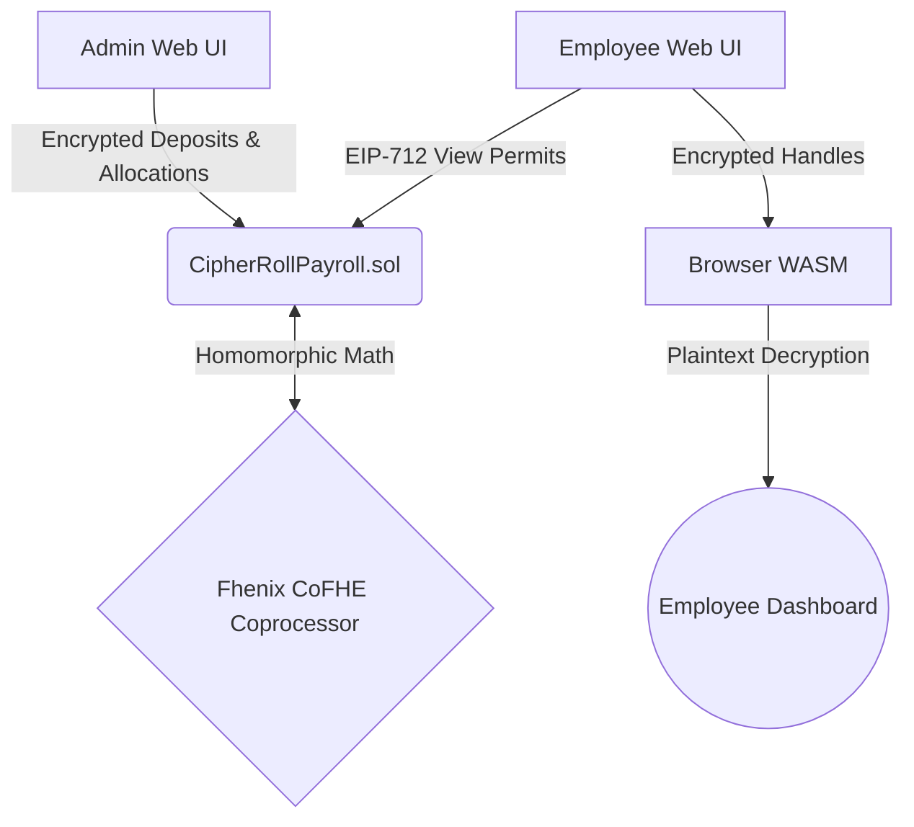

# CipherRoll Architecture

## 🌐 System Overview

CipherRoll is built to provide maximum operational privacy for payroll and treasury management using the **Fhenix CoFHE (Coprocessor for Fully Homomorphic Encryption)** architecture. 

Unlike traditional blockchain applications where state is plaintext, or early privacy protocols relying on isolated ZK-SNARK provers, CipherRoll processes all financial logic directly on the EVM using encrypted variables (`euint128`).

## 🧩 Core Components

### 1. Smart Contract Layer (`CipherRollPayroll.sol`)
The fundamental backend orchestrator deployed on Ethereum Sepolia.
- **State Management:** Manages organizational metadata and encrypted variables (`_encryptedBudget`, `_encryptedAvailable`, `_encryptedCommitted`).
- **Encrypted Math:** Uses `FHE.add`, `FHE.sub`, and `FHE.select` to update balances without revealing values.
- **Access Control:** Implements explicit visibility logic using `FHE.allowThis()` and `FHE.allow()`.

### 2. Client-Side WASM Integration (`cofhejs`)
CipherRoll utilizes standard `ethers.js` connected to an internal WebAssembly worker via `cofhejs.initializeWithEthers(...)`.
- **Decryption:** Encrypted handles pulled from the contract are unsealed directly in the browser cache. No backend proxy ever sees the raw numbers.
- **Zero-Sync:** Replaces the legacy privacy UX where users had to sync thousands of node blocks to retrieve UTXOs.

### 3. Treasury Adapter Layer
- Orchestrates the boundary logic for stablecoin bridging and external liquidation routing.
- Keeps the core payroll logic agnostic of the underlying settlement token.

## 🗄️ Data Model

### Organization State
- `admin`: The operational multisig or wallet.
- `metadataHash`: IPFS or deterministic hash referencing off-chain organization mapping.
- `treasuryRouteId`: The identifier for external settlement adapters.
- **Encrypted State:** `_encryptedBudget`, `_encryptedCommitted`, `_encryptedAvailable`.

### Payroll Allocation State
- `employee`: The recipient wallet address.
- `paymentId`: A deterministic Keccak256 hash preventing duplicate processing.
- `encryptedAmount`: The exact salary disbursement, encrypted globally and allowed only to the recipient.
- `isVesting`: Boolean determining if the allocation unlocks linearly or instantly.

## 🔐 Advanced Privacy Handling

Access to encrypted state is strictly protected by cryptographically secure permits. 
In public blockchains, anyone can scrape open RPCs. In CipherRoll, an explicitly signed EIP-712 permit is required, which is then verified by the **Fhenix TaskManager**. This ensures absolute metadata and state privacy.
