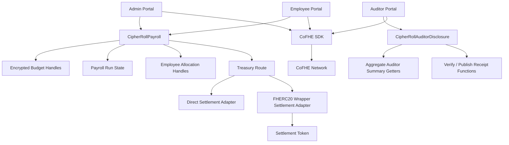
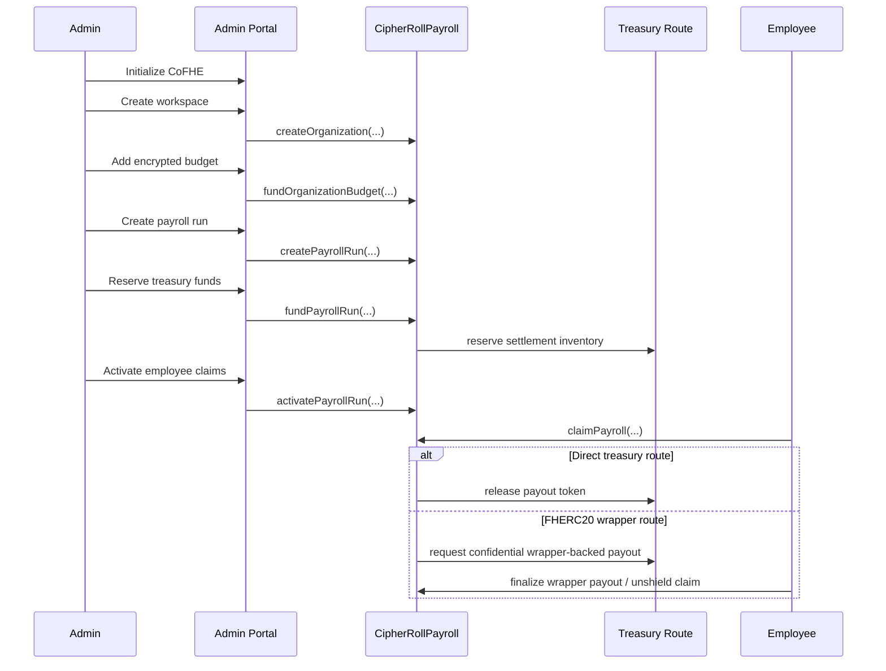

# CipherRoll Architecture

## System Overview

CipherRoll is a confidential payroll system built on **Fhenix CoFHE** and deployed for **Arbitrum Sepolia**.

The core design goal is straightforward:

- keep payroll amounts, budget summaries, and aggregate solvency values encrypted on-chain
- let admins still operate a real payroll workflow
- let employees claim real payouts
- let auditors review only aggregate disclosures
- let compliance evidence become provable when needed

CipherRoll is no longer just an encrypted bookkeeping demo. In the current submission snapshot, it supports real treasury-backed settlement, the official FHERC20 wrapper payout path, local employee decrypts, aggregate auditor permits, on-chain audit receipts, and a first operator-support layer through CipherBot.

---

## Architecture At A Glance

---

## Core Contracts

### `CipherRollPayroll`

The main payroll protocol contract.

Responsibilities:

- create and manage workspaces / organizations
- maintain encrypted organization-level payroll budget state
- create and manage explicit payroll runs
- reserve treasury-backed payroll funding
- activate employee claims only after funding succeeds
- store employee allocation handles
- process employee claims
- coordinate direct treasury or FHERC20-wrapper-backed settlement

Key design property:

CipherRollPayroll performs payroll arithmetic over encrypted handles instead of storing plaintext balances or allocations directly on-chain.

### `CipherRollAuditorDisclosure`

The dedicated auditor disclosure surface.

Responsibilities:

- expose compliance-safe, aggregate-only organization summaries
- expose decryptable aggregate handles for budget / committed / available
- intentionally avoid employee salary rows and employee allocation handles
- support on-chain verification or publication of selected aggregate receipts
- support batched aggregate evidence flows

This contract exists so auditor access does not depend on reusing admin-only getters that were never meant for shared-permit review.

---

## Frontend Surfaces

### Admin Portal

The admin portal is the operator surface for:

- wallet connection and CoFHE initialization
- workspace setup
- encrypted budget funding
- treasury route configuration
- payroll-run creation
- payroll-run funding / activation
- employee allocation issuance
- auditor permit creation and export

### Employee Portal

The employee portal is a self-service claim surface for:

- local permit-based decrypts
- payroll review
- claim initiation
- wrapper-finalize flow when the treasury route uses FHERC20 settlement

### Auditor Portal

The auditor portal is an aggregate-first review surface for:

- importing admin-exported shared permit payloads
- selecting and activating recipient permits
- decrypting only aggregate organization summaries
- creating single-metric or batched verify/publish evidence receipts

### Tax Status / Docs

These are explanatory and documentation-facing surfaces. They are not full tax automation or full regulator workflow products in the current submission.

The docs/admin/auditor surfaces now also include a lightweight CipherBot. It is intentionally narrow: product explanation, workflow support, and privacy-boundary guidance rather than autonomous execution.

---

## Submission-Readiness Hardening

Before the Phase 3 work began in earnest, CipherRoll completed a deliberate hardening pass so the shipped product would be more truthful and more stable:

- wrapper-finalize proof verification now happens on-chain instead of accepting proof-shaped payloads without validation
- wrapper settlement regression coverage now includes wrong plaintext, mismatched request ids, replay attempts, and finalize calls with no pending request
- `allowPublic(...)` naming is aligned with the current CoFHE docs
- privacy wording now matches the real host-chain disclosure boundary for wrapper request/finalize settlement
- a published privacy matrix explains encrypted values, public metadata, explicit product disclosures, and inferable identifiers
- identifier inference was reduced where practical and remaining tradeoffs are called out plainly
- convenience-only route-id and metadata leakage were trimmed before submission

This hardening work matters architecturally because it closes the gap between "what the product says" and "what the contracts and portals actually do."

---

## Encrypted State Model

CipherRoll relies on encrypted handles rather than plaintext amounts for sensitive payroll values.

### Organization-Level Encrypted State

The system maintains encrypted representations of:

- total payroll budget
- committed payroll
- remaining available runway / budget

These values are surfaced to the frontend as handles and decrypted only through the appropriate permit flow.

### Employee-Level Encrypted State

Each payroll item stores:

- employee wallet
- payment id
- encrypted amount handle
- vesting metadata if applicable
- claim/finalization status

The employee wallet can decrypt only the values intentionally exposed to it.

---

## Payroll Lifecycle

The current shipped payroll system is an explicit state machine rather than a single vague action.

Run states in practice:

1. Draft
2. Funded
3. Active
4. Finalized

This explicit lifecycle is important because claimability now depends on successful treasury funding and activation rather than on a loose notion of “issued payroll”.

---

## Treasury Architecture

CipherRoll uses a treasury-route model instead of pretending payroll value exists inside the payroll contract alone.

### Direct Settlement Route

This path releases payout token inventory directly from a treasury-backed adapter.

Useful when:

- the workspace uses direct test-token settlement
- confidential wrapper behavior is not required for the payout step

### FHERC20 Wrapper Settlement Route

This is the preferred current settlement path.

Useful when:

- teams want payroll to stay confidential deeper into the settlement path
- payout should follow the official FHERC20 wrapper request/finalize model

High-level flow:

1. Admin configures wrapper treasury route
2. Payroll run reserves treasury inventory
3. Employee claims payroll
4. System requests wrapper-backed payout
5. Employee finalizes payout through the unshield/claim flow
6. Underlying token is released

This keeps confidential wrapper balances private before the request is decrypted, but once the employee submits the `decryptForTx` finalize proof on-chain the amount is no longer only a local secret.

---

## CoFHE Client Architecture

CipherRoll uses the current `@cofhe/sdk` client flow in the browser.

### Encryption

Admin-side sensitive inputs are prepared with:

- `encryptInputs(...)`

This is used before contract submission for values that should enter the system as encrypted handles.

### Local decrypt for review

Employee and auditor read flows use:

- `decryptForView(...)`

This keeps plaintext inside the browser rather than routing salary or aggregate budget values through a backend service.

### Decrypt for evidence

Auditor receipt flows use:

- `decryptForTx(...)`

This prepares threshold-signed decrypt outputs that can then be:

- verified on-chain
- or published on-chain

depending on the evidence mode selected in the auditor portal.

---

## Auditor Architecture

The current product introduces a real selective-disclosure architecture rather than a placeholder auditor page.

### Admin sharing path

The admin portal can:

- create a named auditor sharing permit
- scope it to a recipient wallet
- set an expiration
- export a non-sensitive sharing payload

### Auditor import path

The auditor portal can:

- import the shared payload
- activate the resulting recipient permit
- decrypt only aggregate budget / committed / available handles

### Aggregate-only review

The auditor surface intentionally centers on:

- organization-level budget
- committed payroll
- available runway
- run counts
- employee counts
- treasury / settlement status

It intentionally avoids:

- employee salary history
- raw employee allocation rows
- admin-only salary getters

### Evidence mode

The auditor can escalate from viewable to provable:

- verify one metric
- publish one metric
- verify a selected batch
- publish a selected batch

This makes the audit architecture useful for both light review and stronger compliance evidence.

---

## Privacy Boundary

CipherRoll’s privacy model is strong, but intentionally honest.

### Private

The following values are designed to stay encrypted:

- organization budget
- committed payroll
- available runway
- employee allocation amounts
- aggregate auditor summary handles
- wrapper-backed confidential balances before wrapper-request decryption

### Public

The following remain public or inferable on the host chain:

- wallet addresses
- organization ids / labels used by transactions
- payroll-run states
- funding deadlines
- claim and finalization activity
- timestamps
- wrapper settlement amount once the wrapper request/finalize decrypt proof is submitted on-chain

### Practical interpretation

CipherRoll does **not** claim that all payroll metadata disappears.

Instead, it keeps the most sensitive financial values encrypted while being explicit that operational metadata and final settlement events still leave public traces.

---

## Permit and Disclosure Model

### Employee permits

Employees use permit-backed decrypt flows to review their own payroll allocation values locally.

### Auditor recipient permits

Auditors use imported shared permits to decrypt only the aggregate handles intentionally exposed for audit review.

### Important limitation

Shared permits do not magically bypass contract access control.

They depend on prior on-chain `FHE.allow(...)` exposure for the specific aggregate handles that CipherRoll intentionally makes reviewable.

### Revocation honesty

Removing a permit from a local browser session is a product-level revoke aid, not a guaranteed universal revoke of every imported copy.

The primary practical controls remain:

- narrow scope
- recipient specificity
- expiration

---

## What The Current Submission Specifically Adds

Compared with the earlier state of the project, the current submission now includes:

- real payroll settlement instead of bookkeeping-only payroll
- explicit payroll lifecycle states
- funding and activation gates
- frontend treasury route setup
- official FHERC20 wrapper settlement path
- meaningful employee payout completion
- aggregate-first auditor portal
- shared-permit-based auditor review
- single and batched on-chain audit receipts
- clearer documentation of what is private vs public

---

## Current Scope Limits

The current submission is intentionally scoped.

Not shipped as live product workflows yet:

- production-grade tax automation
- full regulator portal
- on-chain M-of-N admin governance
- broader multi-network rollout

Active shipped chain target:

- **Arbitrum Sepolia only**

---

## Supporting References

- [README.md](../README.md)
- [ROADMAP.md](./ROADMAP.md)
- [TESTING.md](./TESTING.md)
- [FRONTEND_MANUAL_QA.md](./FRONTEND_MANUAL_QA.md)
