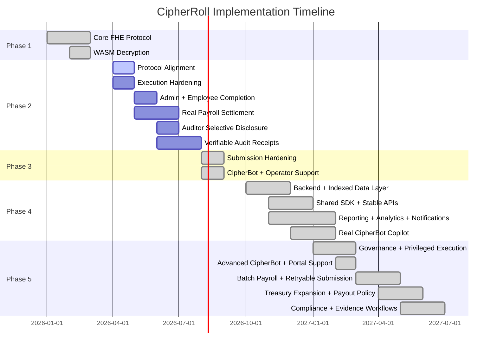

# CipherRoll Product Roadmap

CipherRoll is continuously evolving to support comprehensive enterprise payroll, auditing, and tax compliance needs.

## Phase 1: Core Privacy Protocol (Current)

- [x] Pure Fhenix/EVM project architecture
- [x] `CipherRollPayroll.sol` secure execution contract
- [x] Seamless EVM Wallet authentication
- [x] Homomorphic budgeting and deposit flows
- [x] Confidential payroll issuance (Push, Pull, and Vesting mechanics)
- [x] True client-side decryption via `@cofhe/sdk`
- [x] High-conversion UI/UX utilizing premium glassmorphism

## Phase 2: Protocol Alignment, Portal Completion & Verifiable Privacy (Submission Scope)

Phase 2 is focused on one deliverable above all else: a fully working admin and employee experience built on the latest CoFHE workflow, deployed on **Arbitrum Sepolia**, and backed by much stronger technical proof than Wave 1. Auditor selective-disclosure work is part of the same roadmap, but it should remain explicitly scoped as follow-on functionality until the contract and frontend support it for real.

**Priority 1: Protocol Alignment & Environment Truthfulness**

- **Retire legacy CoFHE client debt end-to-end:** Remove remaining legacy client dependencies from the contract tooling story, frontend copy, docs, and operational flows. Standardize on `@cofhe/sdk` and its explicit builder-pattern APIs (`encryptInputs`, `decryptForView`, `decryptForTx`).
- **Upgrade the root dev stack, not just the frontend:** Migrate testing and local development to the current CoFHE-compatible plugin/mock stack and pin versions that remain compatible with the active `@fhenixprotocol/cofhe-contracts` release.
- **Regenerate interfaces around the latest encrypted-handle model:** Rebuild ABIs, generated types, and deployment metadata around the current `bytes32` ciphertext-handle model so off-chain reads, decrypt flows, and mocks all agree.
- **Eliminate network hallucinations completely:** Ensure all runtime config, docs, deployment artifacts, and user-facing copy point only to **Arbitrum Sepolia**. No lingering Ethereum Sepolia / "Fhenix L2" ambiguity remains anywhere in the product.

**Priority 2: Technical Execution Hardening**

- **Make the proof layer credible:** Restore real automated tests for encrypted budget math, payroll issuance, vesting, access control, failure handling, and permit-enabled reads.
- **Require a clean engineering baseline:** `npm run test`, `npm run compile`, and the frontend production build must all pass consistently before any later Phase 2 milestone is considered complete.
- **Tighten the shipped product to match reality:** Remove stale UI and documentation fragments that overstate what is live, and replace placeholder behavior with explicit, testable system behavior.

**Priority 3: Admin & Employee Portal Completion**

- **Finish the admin portal as an operator-grade surface:** Workspace creation, encrypted budget funding, payroll issuance, organization refresh, and clear failure states must all work smoothly on the supported CoFHE testnets.
- **Finish the employee portal as a trustworthy self-service surface:** Permit creation, allocation retrieval, decryption, vesting visibility, and claim state must be stable and understandable without hidden manual steps.
- **Make vesting and employee self-service meaningfully complete:** Employees should be able to understand whether an allocation is instant, vesting-locked, or claimable, and the claim path must reflect real contract behavior rather than placeholder UX.
- **Ship privacy-safe operator insight instead of raw tables:** Add aggregate-only admin analytics for budget health, committed payroll, available runway, payment counts, and other organization-level metrics without exposing employee-level salary rows.
- **Remove Wave 1 scaffolding that weakens the story:** Strip out stale treasury-route guidance, dummy downloads, and other leftover mock concepts that distract from the real encrypted payroll workflow.

**Priority 4: Real Payroll Settlement**

- [x] **Priority status:** Complete. CipherRoll's preferred FHERC20 wrapper settlement path is now working end to end, including frontend-driven treasury setup, payroll funding, employee claim/finalize flow, and real payout-token balance delivery on Arbitrum Sepolia.
- [x] **Goal 1: Upgrade CipherRoll from allocation tracking to actual settlement:** CipherRoll now supports a real treasury-backed asset-delivery path so employee claims can release an actual token balance on-chain instead of only finalizing internal payroll state.
- [x] **Goal 2: Adopt an explicit payroll lifecycle instead of an implicit one:** The product now models create payroll, upload encrypted allocations, fund escrow, activate claimability, employee claim, and settlement finalization as distinct run states instead of blending them into a single vague payroll action.
- [x] **Goal 3: Introduce explicit funding and activation gates:** Payroll runs now stay non-claimable until encrypted funding is locked from the organization budget and the run is activated successfully on-chain.
- [x] **Goal 4: Stand up a real payroll treasury source:** Admin-side funding can now come from an actual token inventory and treasury-backed escrow model instead of implied value inside the payroll contract alone.
- [x] **Goal 5: Integrate the official FHERC20 wrapper path:** CipherRoll now supports the documented `FHERC20ERC20Wrapper` model in its treasury path so a standard test ERC20 can be shielded into confidential FHERC20 balances, payroll runs can request wrapper-backed settlement, and employees can finalize payout with the official unshield/claim flow.
- [x] **Goal 6: Make employee claim behavior financially meaningful:** Employee claim flows now update actual token balances through both supported settlement paths. The direct treasury route releases the payout token immediately, and the preferred FHERC20 wrapper route has been validated on Arbitrum Sepolia with a live request-and-finalize unshield flow that increased the payout token balance on-chain.
- [x] **Goal 7: Be precise about what is private and what is public:** The product, docs, and QA guides now explicitly state that encrypted payroll amounts and budget summaries remain private, while wallet addresses, ids, timestamps, payroll-run states, and claim/finalization activity remain public. They also explain that wrapper-backed balances stay confidential before wrapper-request decryption, but wrapper settlement amounts can become public once the on-chain `decryptForTx` request/finalize proof flow is used.
- [ ] **Goal 8: Keep a fallback settlement plan ready:** Deferred contingency only. The wrapper-based FHERC20 path succeeded in Phase 2, so the standard ERC20 fallback is no longer a completion blocker and should only be implemented later if testnet stability, judge feedback, or broader compatibility needs justify it.
- **Implementation rule:** Treat [FHERC20_docs.md](/home/baba/fhenix/FHERC20_docs.md) as a local working reference, but verify implementation details against the current installed contract APIs and the latest official Fhenix/CoFHE documentation before locking behavior.

**Priority 5: Auditor Portal via Shared-Permit Selective Disclosure**

- [x] **Goal 1: Add auditor-specific contract read surfaces:** CipherRoll now exposes dedicated auditor getters for compliance-safe organization summaries and shared-permit decryptable aggregate budget handles, without reusing admin-only `msg.sender`-restricted reads or exposing employee salary handles / unnecessary PII.
- [x] **Goal 2: Ship admin-managed auditor sharing flows:** The admin portal now creates and manages current `@cofhe/sdk` sharing permits for named auditor recipients, exports the non-sensitive sharing payload, and explains disclosure scope plus expiration before anything is shared.
- [x] **Goal 3: Build the auditor portal as an aggregate-first surface:** The auditor portal now imports shared permits via the current SDK flow, activates recipient permits, and decrypts only the aggregate summaries explicitly intended for audit review. The UX centers on organization-level balances, commitments, employee counts, policy checks, and runway / solvency status rather than employee-level payroll history.
- [x] **Goal 4: Enforce selective-disclosure boundaries clearly:** Auditor access is now short-lived, scoped, revocable in product terms, and documented honestly across the portal, contract, and docs. CipherRoll makes it explicit which fields are shared through recipient permits, which remain private, and how the shared-permit model depends on prior on-chain `FHE.allow(...)` access granted by the data owner.
- **Implementation rule:** Build Priority 5 against the current `@cofhe/sdk` permits model confirmed in [fhenix_permits.md](/home/baba/fhenix/fhenix_permits.md), especially `client.permits.getOrCreateSelfPermit()`, `createSharing(...)`, and `importShared(...)`, while continuing to verify behavior against the latest official Fhenix docs before locking production-facing UX.

**Priority 6: Verifiable Disclosure & Audit Receipts**

- [x] **Goal 1: Promote selective disclosure from viewable to provable:** The auditor portal now supports `decryptForTx`-backed evidence for shared aggregate metrics. Auditors can produce narrow on-chain receipts through `FHE.verifyDecryptResult(...)` or publish a decrypt result through `FHE.publishDecryptResult(...)`, while CipherRoll keeps the flow scoped to one aggregate metric at a time to minimize unnecessary disclosure.
- [x] **Goal 2: Support batched compliance evidence:** The auditor portal can now generate signed batch receipts for selected aggregate metrics in one transaction. CipherRoll keeps those batches limited to organization-level budget / committed / available disclosures and does not expose employee-level encrypted state.
- [x] **Goal 3: Add audit receipt UX and documentation:** The auditor portal now shows clearly when the user is in view-only permit review versus provable receipt mode, and the docs explain the privacy boundary of each path in plain language, including the difference between local review, verified on-chain receipts, and published decrypt results.

**Non-Blocking Watch Item**

- **Track deeper CoFHE infrastructure changes without derailing delivery:** We will monitor evolving infrastructure such as commitment-oriented integrity tooling, but direct integration is not a submission blocker unless it becomes necessary for supported app-level workflows.

## Phase 3: Submission Hardening & Operator Support (Complete)

- **Phase 3 principle: low-hassle, high-impact only**
  Phase 3 was intentionally scoped as a submission-readiness wave. The goal was to make CipherRoll more truthful, more stable, and easier to operate without introducing a heavy backend rewrite, multi-month governance system, or broad cross-chain complexity.
- [x] **Priority 7A: Patch wrapper-finalize proof verification**
  The wrapper finalize path no longer accepts proof-shaped payloads without validation. CipherRoll now verifies the decrypt result on-chain before releasing the final unshield/claim payout.
- [x] **Priority 7B: Align access-control naming with current CoFHE docs**
  The wrapper claim path now uses `FHE.allowPublic(...)` so the code follows the current documented CoFHE API language instead of relying on older equivalent terminology.
- [x] **Priority 7C: Lock the settlement path with invalid-proof regression tests**
  The contract suite now permanently covers wrong plaintext, mismatched request id, replayed finalize attempts, and finalize calls with no pending request for the wrapper settlement path.
- [x] **Priority 7D: Correct privacy wording and publish a current-product privacy matrix**
  CipherRoll now clearly documents what stays encrypted, what is public by Arbitrum/EVM design, what is emitted or stored intentionally, and when wrapper settlement amounts become public during the request/finalize flow.
- [x] **Priority 7E: Reduce unnecessary identifier inference and trim avoidable leakage**
  The admin portal now offers safer less-guessable identifiers where practical, warns operators about inferable readable labels, and trims convenience-only route-id / metadata exposure that did not need to remain public.
- [x] **Priority 7F: Reconfirm the engineering baseline**
  After the hardening sweep, `npm run compile`, `npm run test`, and `npm run build:web` were all brought back to a stable green state for the current submission snapshot.
- [x] **Priority 7G: Ship a contextual CipherRoll copilot**
  CipherRoll now ships a lightweight `CipherBot` surface in the docs, admin portal, and auditor portal. It answers product-specific questions such as payroll funding flow, wrapper-finalize steps, auditor permit import, disclosure boundaries, and common failure states. The scope stays intentionally narrow: onboarding, explanation, and operator support rather than autonomous execution.

### Phase 3 result

Phase 3 is complete for the current submission. It should be understood as the wave that hardened the live settlement path, made CipherRoll's privacy boundary more truthful, reduced avoidable public leakage, and added the first in-product operator-support layer through CipherBot.

### Explicit Phase 3 non-goals

- Full M-of-N on-chain governance enforcement
- Telegram bot or multi-channel chat operations
- MCP-based payroll execution flows
- Broad compliance-network integrations
- Fiat ramps and cross-chain treasury routing
- A large backend/indexer platform

These are not rejected forever. They are deliberately deferred so Phase 3 stays realistic and shippable.

## Phase 4: Backend Foundation, Shared Platform Layer & Real Product Copilot

Phase 4 is now complete as the first real application-platform wave on top of CipherRoll's submission-ready payroll core. It was intentionally executed as a small number of larger work packages rather than many tiny chores, so the result is a coherent backend, shared SDK layer, operator reporting surface, and real retrieval-backed CipherBot instead of fragmented partial work.

**Implementation inspiration for all Phase 4 work**

Take inspiration from the stronger product-platform patterns already proven in NullPay's backend, SDK, docs, and copilot layers: a small but disciplined backend, normalized indexed reads, typed reusable helpers, clean API boundaries, and a docs-aware product assistant. Do **not** copy branding, product assumptions, or non-CipherRoll workflows. Adapt the architecture to CipherRoll's privacy model, Arbitrum Sepolia deployment, wallet-local decrypt flows, aggregate-only disclosure rules, and payroll/auditor-specific product surfaces.

**External infrastructure stance for Phase 4**

CipherRoll does **not** need Supabase specifically in order to complete Phase 4. The requirement is a reliable backend plus a database-backed indexed read layer, not any one vendor. For a simpler first implementation, prefer a backend that we can stand up and understand fully inside this repo:

- backend service: Node.js + TypeScript
- API layer: lightweight REST routes
- indexed storage: PostgreSQL if available, or SQLite for a simpler first pass
- scheduled/event ingestion: backend worker or polling/indexing loop inside the same service
- notifications: start with in-app/dashboard events or simple email/webhook-style hooks later

This question has now been resolved in the shipped Wave 4 stack: the hosted backend persists through **Supabase-backed Postgres**, while the frontend remains separately deployed and continues to query the backend over stable APIs.

**Plain-language summary for non-backend operators**

Phase 4 does not require you to know backend, SDK, API, database, or indexing details up front. The practical meaning is:

- we add one server that helps the frontend
- we add one database that remembers payroll events cleanly
- we move repeated contract logic into one reusable code package
- we use that cleaner data to power reports, exports, notifications, and a smarter CipherBot

That implementation choice is now complete for the current stack rather than hypothetical.

- **Priority 11: Build the first real CipherRoll backend and indexed data layer**
  This priority should be treated as one connected backend foundation project, not as separate server and database chores. Stand up a small backend service beside the current frontend and contracts, add environment-based config, health checks, structured logs, and a clean project structure, then connect it to an indexed read-model layer that ingests contract events into a normalized database. When this priority is complete, CipherRoll should no longer depend on the browser reconstructing everything ad hoc from chain reads. The backend should be able to serve clean organization, payroll-run, funding, claim, finalize, settlement-request, and audit-receipt data for later reporting, analytics, notifications, and integrations. This backend supports the product; it must not replace wallet-local privacy or centralize private payroll plaintext.

- **Priority 12: Extract a reusable CipherRoll SDK and stable API surface**
  This priority should turn today's scattered frontend helpers into a shared platform layer that both the frontend and future backend/integration code can rely on. Pull stable contract reads, payroll-run reads, treasury-route reads, permit/disclosure helpers, and well-scoped write helpers into a typed CipherRoll SDK, then define clean backend/API boundaries on top of that SDK so future tools do not have to duplicate chain logic. The outcome should be simple to understand even for a non-backend operator: one reusable code layer for "how CipherRoll talks to contracts" and one clean API layer for "how products and integrations consume that data." Keep the SDK narrow and disciplined rather than trying to make it a giant everything-library in one pass.

- **Priority 13: Ship operator reporting, exports, analytics, and notification workflows**
  This priority should package the indexed backend data into practical product outputs for admins and auditors instead of leaving the new backend as invisible plumbing. Add backend-safe reporting APIs, export generation, aggregate-only organization analytics, treasury and run-state summaries, audit-receipt packaging, and notification triggers for meaningful workflow events such as funded runs, activated claims, employee claims, wrapper finalizations, shared auditor permits, and published receipts. The main idea is simple: once Phase 4 is done, CipherRoll operators should have a much better operational surface for understanding what happened, what is pending, what was disclosed, and what evidence can be exported, without exposing employee-level private data.

- **Priority 14: Turn CipherBot into a real retrieval-backed CipherRoll copilot**
  This priority is now complete for its first real shipped version. The original Phase 3 CipherBot was intentionally lightweight and button-driven; the Phase 4 upgrade turns it into a real chat-style product copilot that answers free-form questions from indexed docs, roadmap context, product guidance, and portal-aware workflow knowledge. It is now live in the docs, admin, auditor, and employee portals as a support-oriented assistant rather than an action-taking agent.

### Phase 4 Follow-Up Note

Phase 4 is complete, but a few worthwhile polish items remain and should be treated as later follow-up work rather than blockers:

- broaden the retrieval corpus with even more product docs, troubleshooting notes, and portal-state examples
- improve CipherBot ranking, context windows, and answer composition over time
- deepen backend search/filter/report ergonomics where useful for operators
- revisit auth hardening and deeper operational guardrails once the next platform wave begins

### Implemented Phase 4 stack

The shipped Wave 4 stack now looks like this:

- `backend/` service in Node.js + TypeScript
- Supabase-backed PostgreSQL for hosted persistence
- simple REST API routes for status, summaries, runs, payments, receipts, notifications, exports, and support
- one reusable `packages/cipherroll-sdk` package for shared chain and product helpers
- retrieval-backed CipherBot integrated into docs and product portals

This keeps the first real CipherRoll platform layer understandable while also making the hosted product much closer to the local review experience.

### Backend responsibilities in Phase 4

CipherRoll's backend should eventually handle these non-sensitive platform concerns:

- user/session-aware API orchestration where needed
- environment and deployment config
- indexed contract event storage
- search and filtering across organizations and payroll runs
- aggregate analytics materialization
- export/report generation
- notification delivery
- audit-log collection for operational actions
- integration endpoints for third-party systems

CipherRoll's backend should **not** casually centralize secrets or private payroll data that are meant to stay user-controlled. Client-side permit/decrypt flows remain part of the architecture even as the backend grows.

## Phase 5: Advanced Operations, Governance & Ecosystem Expansion

Once the backend foundation exists, CipherRoll can safely take on the heavier features that are meaningful but not lightweight.

Phase 5 should absorb the remaining non-blocking Phase 4 polish where it naturally fits, especially deeper copilot retrieval quality, stronger backend operational hardening, and richer search/report ergonomics. It should be executed as a **small number of large, coherent work packages** so we do not keep re-paying the same compile/test/build/deploy tax for tiny isolated chores.

This is also the **final planned phase** for the current CipherRoll arc, so the default bias should be:

- deepen and harden what already exists
- prefer judge-visible improvements that build on shipped infrastructure
- reject attractive but sprawling subprojects that create a risk of ending the project in an incomplete or unstable state
- avoid reopening architecture questions that would force major contract, backend, and frontend churn all at once

### Phase 5 execution rules

- Every Phase 5 priority should be large enough that one Codex run can implement it end-to-end, including code, docs, tests, and product copy.
- Contract-changing priorities should come before integration-heavy priorities so later work builds on stable execution boundaries.
- All new privacy features must stay aligned with the current Fhenix / CoFHE guidance:
  - prefer the current `@cofhe/sdk` builder APIs such as `encryptInputs(...)`, `decryptForView(...)`, and `decryptForTx(...)`
  - prefer the recommended `client.permits.*` flow for self, sharing, and recipient permits rather than reviving older implicit or legacy patterns
  - keep wallet-local decrypts and permit-scoped access as first-class constraints even when backend/reporting features grow
  - treat `decryptForTx` and permit usage as explicit disclosure events, not invisible background mechanics
- If a proposed feature sounds novel but requires large new privacy semantics, major provider migration, or a new pseudo-enterprise surface that the current product does not truly need, it should be cut or deferred rather than forced into the last phase.
- Each priority below includes its own intended scope, guardrails, and validation target so it can be pasted directly into Codex as one work package.

### Recommended execution order

1. Governance and privileged execution hardening
2. Advanced CipherBot quality and support refinement
3. Batch payroll authoring, sealed encryption, and retryable submission
4. Treasury expansion and payout policy surface
5. Compliance, tax, and evidence workflows

**Why the order changes here**

- Governance still comes first because later sensitive treasury or compliance flows must not bypass it.
- CipherBot moves ahead of the remaining large work because it is already live, already judge-visible, low protocol risk, and high ROI for the final product walk-through.
- Batch payroll comes next because it closes a major admin-product gap without needing a new contract and should be designed before later treasury/compliance polish reinforces the one-row issuance workflow.
- Treasury stays ahead of compliance because it still changes execution boundaries and failure handling.
- Compliance is kept, but narrowed to Tier A only.
- Integrations are no longer a core final-phase priority because the remaining webhook/delivery work has low FHE signal and low judge-visible payoff compared with batch payroll.

- **Priority 15: Governance and privileged execution hardening**
  Turn today's reserved-admin / quorum metadata into a real controlled execution model. This priority should implement M-of-N governance for sensitive admin actions such as treasury-route changes, high-impact payroll configuration, compliance-facing disclosure settings, and any future integration secrets or policy toggles. Treat this as one protocol-plus-product package: contract proposal/approval/execution flows, frontend governance UX, backend indexing of governance events, and updated docs/test coverage. The Codex brief for this priority should explicitly require: proposal hashing, approval state, expiration/cancellation rules, threshold checks, replay protection, clear signer role boundaries, and a migration path that does not silently break existing single-admin workflows. It must also explicitly treat Fhenix / CoFHE permits as **decryption-access primitives, not governance primitives**: permit sharing may help multiple admins review encrypted payroll data, but M-of-N execution approval must still be implemented through standard Solidity governance or multisig-style approval logic using the respective admin wallets. Separate physical devices may be used in production, but they must not be assumed as a hard requirement for local testing, QA, or development. Guardrails: stay aligned with CoFHE best practice by keeping decrypt permissions explicit, avoid backend-centralized execution authority, do not add governance that can bypass permit/ACL assumptions, and do not let future Codex runs collapse permit-sharing semantics into transaction-approval semantics. Validation target: compile, tests, frontend build, governance event indexing, and end-to-end admin governance flow on the supported chain.

- **Priority 16: Advanced CipherBot and portal-aware support quality**
  Priority 16 is now complete as a focused CipherBot quality pass, not a new AI platform. CipherBot now uses stronger portal-aware prompts, blends built-in product knowledge with markdown retrieval and backend-indexed context inside the Gemini prompt, handles operator questions like "why is this claim pending?" and "why can’t I activate this run?", and refuses any request to execute, fund, reserve, activate, approve, claim, finalize, or disclose payroll on the user's behalf. The current implementation stays on the Gemini-backed `/api/chat` architecture, rotates across the configured Gemini flash models before reporting provider unavailability, keeps CoFHE permits framed as decryption-access primitives rather than governance approvals, and preserves all wallet/governance/treasury execution boundaries.

- **Priority 17: Batch payroll authoring, sealed encryption, and retryable submission**
  Priority 17 is now complete for batch payroll v1. The admin portal has a non-governed batch workspace with manual rows, browser-only CSV import, a local role table, row validation, review-before-encryption, CoFHE warmup/progress messaging, salary masking after sealing, instant-or-vesting batch mode, and retryable queue chunks where each row still maps to an existing single-row `issueConfidentialPayrollToRun(...)` or `issueVestingAllocationToRun(...)` contract call. Governed workspaces see an explicit warning and cannot seal or submit batch rows. The backend now stores a safe manifest after confirmed row submission containing org id, payroll run id, employee address, role slug/label, payment id, and tx hash, without role base salaries or salary amounts. Docs and CipherBot explain that batch v1 is browser-local, non-governed only, and not a multi-row on-chain transaction.

- **Priority 18: Treasury expansion and payout policy surface**
  Priority 18 is now complete as a disciplined treasury-hardening pass. The treasury adapter interface exposes per-run reserved funding, `CipherRollPayroll` adds a run-level treasury funding view, wrapper settlement requests are pinned to the adapter that created them so route changes cannot silently finalize against a different path, and regression coverage verifies the route-mismatch failure. The backend now serves a treasury exposure summary with route health, available/reserved inventory, payout backlog, funded/active run exposure, and safety notes, and exports include that treasury section without employee salary rows. The admin reporting panel displays this route health and payout backlog, while CipherBot/docs explain that the analytics are operational counts and reserve posture, not plaintext salary disclosure.

- **Priority 19: Compliance, tax, and evidence workflows**
  Priority 19 is now complete as a Tier A aggregate compliance layer. `/tax-authority` is a real compliance route that loads backend compliance packages, applies an explicit aggregate tax reserve basis-point policy, summarizes treasury posture and receipt evidence, and exports JSON/CSV policy packages without employee plaintext salary rows. The backend now serves `/api/compliance/organizations/:orgId/package` and `/api/compliance/organizations/:orgId/export`, while docs and CipherBot explain that this is not a tax filing, not an external authority integration, and not a bypass around auditor receipt flows. Regulator-facing review remains aggregate-first, and `decryptForTx` remains documented as deliberate evidence generation through existing auditor verify/publish receipt paths.

### Explicitly deferred ideas for this final phase

These ideas may be interesting later, but they should **not** be treated as default Phase 5 scope unless there is clearly enough time after the core priorities above are stable:

- dark-pool or fully hidden treasury-funding abstractions
- encrypted vesting unlock timestamps as a new timing/privacy model
- large external compliance-network simulations
- webhook / delivery-history integration work as a core build target
- Slack / Telegram operational bot surfaces
- action-taking AI assistants
- novel encrypted payroll-diff computation unless it can be justified as a very tight, low-risk build on top of the stabilized treasury model
- solvency-proof widgets or encrypted payroll-diff demos that reopen earlier deferred scope

### Final-phase decision principle

If a candidate feature is exciting but risks leaving CipherRoll with:

- partially finished contract logic
- under-tested privacy semantics
- confusing judge-facing UX
- duplicated infrastructure that Wave 4 already covered
- or a provider / deployment migration late in the project

then it should be cut in favor of a cleaner, more reliable finish on the priorities above.

## Architecture Decision

- Judge confirmed that a technically correct, CoFHE-aligned custom confidential token wrapper / settlement adapter is acceptable for CipherRoll.
- Strict migration to the official FHERC20 contract surface is not required for evaluation.
- The active delivery path is therefore: treat Phase 3 as completed submission hardening and operator support, then move the remaining SDK, reporting, analytics, backend, and deeper assistant work into later phases without treating official-FHERC20 migration as a blocker.
