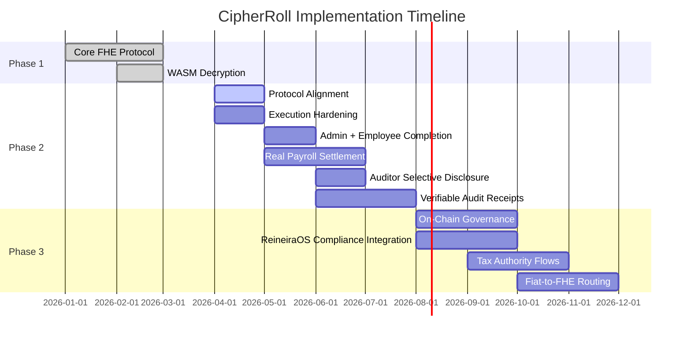

# CipherRoll Product Roadmap

CipherRoll is continuously evolving to support comprehensive enterprise payroll, auditing, and tax compliance needs.

## Phase 1: Core Privacy Protocol (Current)
- [x] Pure Fhenix/EVM project architecture
- [x] `CipherRollPayroll.sol` secure execution contract
- [x] Seamless EVM Wallet authentication
- [x] Homomorphic budgeting and deposit flows
- [x] Confidential payroll issuance (Push, Pull, and Vesting mechanics)
- [x] True client-side decryption via `@cofhe/sdk`
- [x] High-conversion UI/UX utilizing premium glassmorphism 

## Phase 2: Protocol Alignment, Portal Completion & Verifiable Privacy (Submission Scope)

Phase 2 is focused on one deliverable above all else: a fully working admin and employee experience built on the latest CoFHE workflow, deployed on **Arbitrum Sepolia**, and backed by much stronger technical proof than Wave 1. Auditor selective-disclosure work is part of the same roadmap, but it should remain explicitly scoped as follow-on functionality until the contract and frontend support it for real.

**Priority 1: Protocol Alignment & Environment Truthfulness**
- **Retire legacy CoFHE client debt end-to-end:** Remove remaining legacy client dependencies from the contract tooling story, frontend copy, docs, and operational flows. Standardize on `@cofhe/sdk` and its explicit builder-pattern APIs (`encryptInputs`, `decryptForView`, `decryptForTx`).
- **Upgrade the root dev stack, not just the frontend:** Migrate testing and local development to the current CoFHE-compatible plugin/mock stack and pin versions that remain compatible with the active `@fhenixprotocol/cofhe-contracts` release.
- **Regenerate interfaces around the latest encrypted-handle model:** Rebuild ABIs, generated types, and deployment metadata around the current `bytes32` ciphertext-handle model so off-chain reads, decrypt flows, and mocks all agree.
- **Eliminate network hallucinations completely:** Ensure all runtime config, docs, deployment artifacts, and user-facing copy point only to **Arbitrum Sepolia**. No lingering Ethereum Sepolia / "Fhenix L2" ambiguity remains anywhere in the product.

**Priority 2: Technical Execution Hardening**
- **Make the proof layer credible:** Restore real automated tests for encrypted budget math, payroll issuance, vesting, access control, failure handling, and permit-enabled reads.
- **Require a clean engineering baseline:** `npm run test`, `npm run compile`, and the frontend production build must all pass consistently before any later Phase 2 milestone is considered complete.
- **Tighten the shipped product to match reality:** Remove stale UI and documentation fragments that overstate what is live, and replace placeholder behavior with explicit, testable system behavior.

**Priority 3: Admin & Employee Portal Completion**
- **Finish the admin portal as an operator-grade surface:** Workspace creation, encrypted budget funding, payroll issuance, organization refresh, and clear failure states must all work smoothly on the supported CoFHE testnets.
- **Finish the employee portal as a trustworthy self-service surface:** Permit creation, allocation retrieval, decryption, vesting visibility, and claim state must be stable and understandable without hidden manual steps.
- **Make vesting and employee self-service meaningfully complete:** Employees should be able to understand whether an allocation is instant, vesting-locked, or claimable, and the claim path must reflect real contract behavior rather than placeholder UX.
- **Ship privacy-safe operator insight instead of raw tables:** Add aggregate-only admin analytics for budget health, committed payroll, available runway, payment counts, and other organization-level metrics without exposing employee-level salary rows.
- **Remove Wave 1 scaffolding that weakens the story:** Strip out stale treasury-route guidance, dummy downloads, and other leftover mock concepts that distract from the real encrypted payroll workflow.

**Priority 4: Real Payroll Settlement**
- [x] **Priority status:** Complete. CipherRoll's preferred FHERC20 wrapper settlement path is now working end to end, including frontend-driven treasury setup, payroll funding, employee claim/finalize flow, and real payout-token balance delivery on Arbitrum Sepolia.
- [x] **Goal 1: Upgrade CipherRoll from allocation tracking to actual settlement:** CipherRoll now supports a real treasury-backed asset-delivery path so employee claims can release an actual token balance on-chain instead of only finalizing internal payroll state.
- [x] **Goal 2: Adopt an explicit payroll lifecycle instead of an implicit one:** The product now models create payroll, upload encrypted allocations, fund escrow, activate claimability, employee claim, and settlement finalization as distinct run states instead of blending them into a single vague payroll action.
- [x] **Goal 3: Introduce explicit funding and activation gates:** Payroll runs now stay non-claimable until encrypted funding is locked from the organization budget and the run is activated successfully on-chain.
- [x] **Goal 4: Stand up a real payroll treasury source:** Admin-side funding can now come from an actual token inventory and treasury-backed escrow model instead of implied value inside the payroll contract alone.
- [x] **Goal 5: Integrate the official FHERC20 wrapper path:** CipherRoll now supports the documented `FHERC20ERC20Wrapper` model in its treasury path so a standard test ERC20 can be shielded into confidential FHERC20 balances, payroll runs can request wrapper-backed settlement, and employees can finalize payout with the official unshield/claim flow.
- [x] **Goal 6: Make employee claim behavior financially meaningful:** Employee claim flows now update actual token balances through both supported settlement paths. The direct treasury route releases the payout token immediately, and the preferred FHERC20 wrapper route has been validated on Arbitrum Sepolia with a live request-and-finalize unshield flow that increased the payout token balance on-chain.
- [x] **Goal 7: Be precise about what is private and what is public:** The product, docs, and QA guides now explicitly state that encrypted payroll amounts and budget summaries remain private, while wallet addresses, ids, timestamps, payroll-run states, and claim/finalization activity remain public. They also explain that wrapper-backed settlement stays confidential until the employee finalizes the unshielded payout, at which point the underlying token amount becomes public on-chain.
- [ ] **Goal 8: Keep a fallback settlement plan ready:** Deferred contingency only. The wrapper-based FHERC20 path succeeded in Phase 2, so the standard ERC20 fallback is no longer a completion blocker and should only be implemented later if testnet stability, judge feedback, or broader compatibility needs justify it.
- **Implementation rule:** Treat [FHERC20_docs.md](/home/baba/fhenix/FHERC20_docs.md) as a local working reference, but verify implementation details against the current installed contract APIs and the latest official Fhenix/CoFHE documentation before locking behavior.

**Priority 5: Auditor Portal via Shared-Permit Selective Disclosure**
- [x] **Goal 1: Add auditor-specific contract read surfaces:** CipherRoll now exposes dedicated auditor getters for compliance-safe organization summaries and shared-permit decryptable aggregate budget handles, without reusing admin-only `msg.sender`-restricted reads or exposing employee salary handles / unnecessary PII.
- [x] **Goal 2: Ship admin-managed auditor sharing flows:** The admin portal now creates and manages current `@cofhe/sdk` sharing permits for named auditor recipients, exports the non-sensitive sharing payload, and explains disclosure scope plus expiration before anything is shared.
- [x] **Goal 3: Build the auditor portal as an aggregate-first surface:** The auditor portal now imports shared permits via the current SDK flow, activates recipient permits, and decrypts only the aggregate summaries explicitly intended for audit review. The UX centers on organization-level balances, commitments, employee counts, policy checks, and runway / solvency status rather than employee-level payroll history.
- [x] **Goal 4: Enforce selective-disclosure boundaries clearly:** Auditor access is now short-lived, scoped, revocable in product terms, and documented honestly across the portal, contract, and docs. CipherRoll makes it explicit which fields are shared through recipient permits, which remain private, and how the shared-permit model depends on prior on-chain `FHE.allow(...)` access granted by the data owner.
- **Implementation rule:** Build Priority 5 against the current `@cofhe/sdk` permits model confirmed in [fhenix_permits.md](/home/baba/fhenix/fhenix_permits.md), especially `client.permits.getOrCreateSelfPermit()`, `createSharing(...)`, and `importShared(...)`, while continuing to verify behavior against the latest official Fhenix docs before locking production-facing UX.

**Priority 6: Verifiable Disclosure & Audit Receipts**
- [x] **Goal 1: Promote selective disclosure from viewable to provable:** The auditor portal now supports `decryptForTx`-backed evidence for shared aggregate metrics. Auditors can produce narrow on-chain receipts through `FHE.verifyDecryptResult(...)` or publish a decrypt result through `FHE.publishDecryptResult(...)`, while CipherRoll keeps the flow scoped to one aggregate metric at a time to minimize unnecessary disclosure.
- [x] **Goal 2: Support batched compliance evidence:** The auditor portal can now generate signed batch receipts for selected aggregate metrics in one transaction. CipherRoll keeps those batches limited to organization-level budget / committed / available disclosures and does not expose employee-level encrypted state.
- [x] **Goal 3: Add audit receipt UX and documentation:** The auditor portal now shows clearly when the user is in view-only permit review versus provable receipt mode, and the docs explain the privacy boundary of each path in plain language, including the difference between local review, verified on-chain receipts, and published decrypt results.

**Non-Blocking Watch Item**
- **Track deeper CoFHE infrastructure changes without derailing delivery:** We will monitor evolving infrastructure such as commitment-oriented integrity tooling, but direct integration is not a submission blocker unless it becomes necessary for supported app-level workflows.

## Phase 3: Governance, Compliance Integration & Expansion
- **Priority 7: Real On-Chain Governance (M-of-N Admins)**
  Turn reserved quorum metadata into real enforcement by upgrading the protocol from a single-admin execution model into actual M-of-N admin approval with proposal hashing, approval state tracking, threshold checks, and controlled execution.
- **Priority 7: Governance must stay on-chain, not cosmetic**
  The goal is not a frontend queue of approvals; it is true on-chain execution gating that judges can recognize as substantive technical governance.
- **Priority 8: Optional ReineiraOS Compliance Integration**
  Treat `@reineira-os/sdk` as an extension, not a dependency for core readiness. Integrate it only after the CoFHE migration, portal completion, settlement, and disclosure stack are stable.
- **Priority 8: Use ReineiraOS only for optional resolver/compliance workflows**
  It can strengthen later compliance automation, but it should not pull the core CipherRoll architecture back into legacy patterns once the submission scope is already complete.
- **Tax Authority Workflows:** Automated, FHE-encrypted tax withholding and provisioning paths that grant visibility strictly to mapped government addresses.
- **Advanced Treasury Analytics:** Expanding the dashboard to include cross-chain flow analysis while preserving specific PII privacy.
- **Expanded Aggregate-Only Analytics:** Extend the Phase 2 admin insight model into richer organization-level reporting without exposing employee-level salary data or unnecessary personal metadata.
- **Automated Fiat On-Ramps:** Frictionless payroll settlement where organizations deposit fiat, auto-convert to encrypted stablecoins, and distribute on-chain.

