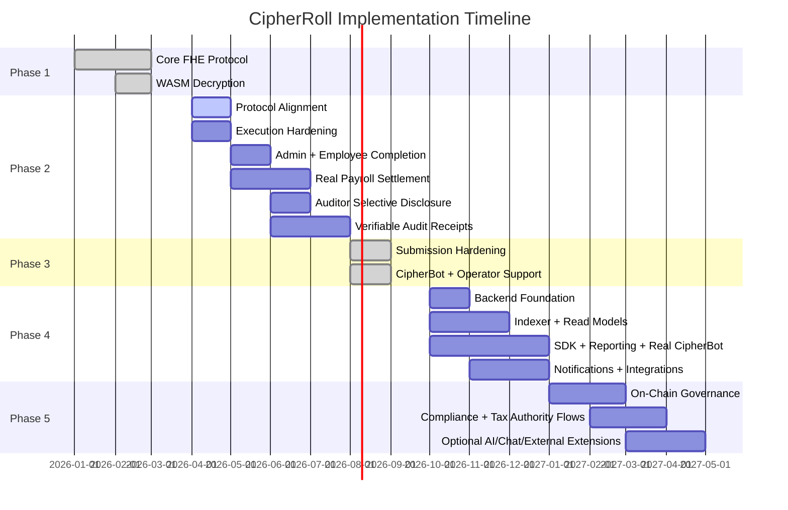

# CipherRoll Product Roadmap

CipherRoll is continuously evolving to support comprehensive enterprise payroll, auditing, and tax compliance needs.

## Phase 1: Core Privacy Protocol (Current)

- [x] Pure Fhenix/EVM project architecture
- [x] `CipherRollPayroll.sol` secure execution contract
- [x] Seamless EVM Wallet authentication
- [x] Homomorphic budgeting and deposit flows
- [x] Confidential payroll issuance (Push, Pull, and Vesting mechanics)
- [x] True client-side decryption via `@cofhe/sdk`
- [x] High-conversion UI/UX utilizing premium glassmorphism

## Phase 2: Protocol Alignment, Portal Completion & Verifiable Privacy (Submission Scope)

Phase 2 is focused on one deliverable above all else: a fully working admin and employee experience built on the latest CoFHE workflow, deployed on **Arbitrum Sepolia**, and backed by much stronger technical proof than Wave 1. Auditor selective-disclosure work is part of the same roadmap, but it should remain explicitly scoped as follow-on functionality until the contract and frontend support it for real.

**Priority 1: Protocol Alignment & Environment Truthfulness**

- **Retire legacy CoFHE client debt end-to-end:** Remove remaining legacy client dependencies from the contract tooling story, frontend copy, docs, and operational flows. Standardize on `@cofhe/sdk` and its explicit builder-pattern APIs (`encryptInputs`, `decryptForView`, `decryptForTx`).
- **Upgrade the root dev stack, not just the frontend:** Migrate testing and local development to the current CoFHE-compatible plugin/mock stack and pin versions that remain compatible with the active `@fhenixprotocol/cofhe-contracts` release.
- **Regenerate interfaces around the latest encrypted-handle model:** Rebuild ABIs, generated types, and deployment metadata around the current `bytes32` ciphertext-handle model so off-chain reads, decrypt flows, and mocks all agree.
- **Eliminate network hallucinations completely:** Ensure all runtime config, docs, deployment artifacts, and user-facing copy point only to **Arbitrum Sepolia**. No lingering Ethereum Sepolia / "Fhenix L2" ambiguity remains anywhere in the product.

**Priority 2: Technical Execution Hardening**

- **Make the proof layer credible:** Restore real automated tests for encrypted budget math, payroll issuance, vesting, access control, failure handling, and permit-enabled reads.
- **Require a clean engineering baseline:** `npm run test`, `npm run compile`, and the frontend production build must all pass consistently before any later Phase 2 milestone is considered complete.
- **Tighten the shipped product to match reality:** Remove stale UI and documentation fragments that overstate what is live, and replace placeholder behavior with explicit, testable system behavior.

**Priority 3: Admin & Employee Portal Completion**

- **Finish the admin portal as an operator-grade surface:** Workspace creation, encrypted budget funding, payroll issuance, organization refresh, and clear failure states must all work smoothly on the supported CoFHE testnets.
- **Finish the employee portal as a trustworthy self-service surface:** Permit creation, allocation retrieval, decryption, vesting visibility, and claim state must be stable and understandable without hidden manual steps.
- **Make vesting and employee self-service meaningfully complete:** Employees should be able to understand whether an allocation is instant, vesting-locked, or claimable, and the claim path must reflect real contract behavior rather than placeholder UX.
- **Ship privacy-safe operator insight instead of raw tables:** Add aggregate-only admin analytics for budget health, committed payroll, available runway, payment counts, and other organization-level metrics without exposing employee-level salary rows.
- **Remove Wave 1 scaffolding that weakens the story:** Strip out stale treasury-route guidance, dummy downloads, and other leftover mock concepts that distract from the real encrypted payroll workflow.

**Priority 4: Real Payroll Settlement**

- [x] **Priority status:** Complete. CipherRoll's preferred FHERC20 wrapper settlement path is now working end to end, including frontend-driven treasury setup, payroll funding, employee claim/finalize flow, and real payout-token balance delivery on Arbitrum Sepolia.
- [x] **Goal 1: Upgrade CipherRoll from allocation tracking to actual settlement:** CipherRoll now supports a real treasury-backed asset-delivery path so employee claims can release an actual token balance on-chain instead of only finalizing internal payroll state.
- [x] **Goal 2: Adopt an explicit payroll lifecycle instead of an implicit one:** The product now models create payroll, upload encrypted allocations, fund escrow, activate claimability, employee claim, and settlement finalization as distinct run states instead of blending them into a single vague payroll action.
- [x] **Goal 3: Introduce explicit funding and activation gates:** Payroll runs now stay non-claimable until encrypted funding is locked from the organization budget and the run is activated successfully on-chain.
- [x] **Goal 4: Stand up a real payroll treasury source:** Admin-side funding can now come from an actual token inventory and treasury-backed escrow model instead of implied value inside the payroll contract alone.
- [x] **Goal 5: Integrate the official FHERC20 wrapper path:** CipherRoll now supports the documented `FHERC20ERC20Wrapper` model in its treasury path so a standard test ERC20 can be shielded into confidential FHERC20 balances, payroll runs can request wrapper-backed settlement, and employees can finalize payout with the official unshield/claim flow.
- [x] **Goal 6: Make employee claim behavior financially meaningful:** Employee claim flows now update actual token balances through both supported settlement paths. The direct treasury route releases the payout token immediately, and the preferred FHERC20 wrapper route has been validated on Arbitrum Sepolia with a live request-and-finalize unshield flow that increased the payout token balance on-chain.
- [x] **Goal 7: Be precise about what is private and what is public:** The product, docs, and QA guides now explicitly state that encrypted payroll amounts and budget summaries remain private, while wallet addresses, ids, timestamps, payroll-run states, and claim/finalization activity remain public. They also explain that wrapper-backed balances stay confidential before wrapper-request decryption, but wrapper settlement amounts can become public once the on-chain `decryptForTx` request/finalize proof flow is used.
- [ ] **Goal 8: Keep a fallback settlement plan ready:** Deferred contingency only. The wrapper-based FHERC20 path succeeded in Phase 2, so the standard ERC20 fallback is no longer a completion blocker and should only be implemented later if testnet stability, judge feedback, or broader compatibility needs justify it.
- **Implementation rule:** Treat [FHERC20_docs.md](/home/baba/fhenix/FHERC20_docs.md) as a local working reference, but verify implementation details against the current installed contract APIs and the latest official Fhenix/CoFHE documentation before locking behavior.

**Priority 5: Auditor Portal via Shared-Permit Selective Disclosure**

- [x] **Goal 1: Add auditor-specific contract read surfaces:** CipherRoll now exposes dedicated auditor getters for compliance-safe organization summaries and shared-permit decryptable aggregate budget handles, without reusing admin-only `msg.sender`-restricted reads or exposing employee salary handles / unnecessary PII.
- [x] **Goal 2: Ship admin-managed auditor sharing flows:** The admin portal now creates and manages current `@cofhe/sdk` sharing permits for named auditor recipients, exports the non-sensitive sharing payload, and explains disclosure scope plus expiration before anything is shared.
- [x] **Goal 3: Build the auditor portal as an aggregate-first surface:** The auditor portal now imports shared permits via the current SDK flow, activates recipient permits, and decrypts only the aggregate summaries explicitly intended for audit review. The UX centers on organization-level balances, commitments, employee counts, policy checks, and runway / solvency status rather than employee-level payroll history.
- [x] **Goal 4: Enforce selective-disclosure boundaries clearly:** Auditor access is now short-lived, scoped, revocable in product terms, and documented honestly across the portal, contract, and docs. CipherRoll makes it explicit which fields are shared through recipient permits, which remain private, and how the shared-permit model depends on prior on-chain `FHE.allow(...)` access granted by the data owner.
- **Implementation rule:** Build Priority 5 against the current `@cofhe/sdk` permits model confirmed in [fhenix_permits.md](/home/baba/fhenix/fhenix_permits.md), especially `client.permits.getOrCreateSelfPermit()`, `createSharing(...)`, and `importShared(...)`, while continuing to verify behavior against the latest official Fhenix docs before locking production-facing UX.

**Priority 6: Verifiable Disclosure & Audit Receipts**

- [x] **Goal 1: Promote selective disclosure from viewable to provable:** The auditor portal now supports `decryptForTx`-backed evidence for shared aggregate metrics. Auditors can produce narrow on-chain receipts through `FHE.verifyDecryptResult(...)` or publish a decrypt result through `FHE.publishDecryptResult(...)`, while CipherRoll keeps the flow scoped to one aggregate metric at a time to minimize unnecessary disclosure.
- [x] **Goal 2: Support batched compliance evidence:** The auditor portal can now generate signed batch receipts for selected aggregate metrics in one transaction. CipherRoll keeps those batches limited to organization-level budget / committed / available disclosures and does not expose employee-level encrypted state.
- [x] **Goal 3: Add audit receipt UX and documentation:** The auditor portal now shows clearly when the user is in view-only permit review versus provable receipt mode, and the docs explain the privacy boundary of each path in plain language, including the difference between local review, verified on-chain receipts, and published decrypt results.

**Non-Blocking Watch Item**

- **Track deeper CoFHE infrastructure changes without derailing delivery:** We will monitor evolving infrastructure such as commitment-oriented integrity tooling, but direct integration is not a submission blocker unless it becomes necessary for supported app-level workflows.

## Phase 3: Submission Hardening & Operator Support (Complete)

- **Phase 3 principle: low-hassle, high-impact only**
  Phase 3 was intentionally scoped as a submission-readiness wave. The goal was to make CipherRoll more truthful, more stable, and easier to operate without introducing a heavy backend rewrite, multi-month governance system, or broad cross-chain complexity.
- [x] **Priority 7A: Patch wrapper-finalize proof verification**
  The wrapper finalize path no longer accepts proof-shaped payloads without validation. CipherRoll now verifies the decrypt result on-chain before releasing the final unshield/claim payout.
- [x] **Priority 7B: Align access-control naming with current CoFHE docs**
  The wrapper claim path now uses `FHE.allowPublic(...)` so the code follows the current documented CoFHE API language instead of relying on older equivalent terminology.
- [x] **Priority 7C: Lock the settlement path with invalid-proof regression tests**
  The contract suite now permanently covers wrong plaintext, mismatched request id, replayed finalize attempts, and finalize calls with no pending request for the wrapper settlement path.
- [x] **Priority 7D: Correct privacy wording and publish a current-product privacy matrix**
  CipherRoll now clearly documents what stays encrypted, what is public by Arbitrum/EVM design, what is emitted or stored intentionally, and when wrapper settlement amounts become public during the request/finalize flow.
- [x] **Priority 7E: Reduce unnecessary identifier inference and trim avoidable leakage**
  The admin portal now offers safer less-guessable identifiers where practical, warns operators about inferable readable labels, and trims convenience-only route-id / metadata exposure that did not need to remain public.
- [x] **Priority 7F: Reconfirm the engineering baseline**
  After the hardening sweep, `npm run compile`, `npm run test`, and `npm run build:web` were all brought back to a stable green state for the current submission snapshot.
- [x] **Priority 7G: Ship a contextual CipherRoll copilot**
  CipherRoll now ships a lightweight `CipherBot` surface in the docs, admin portal, and auditor portal. It answers product-specific questions such as payroll funding flow, wrapper-finalize steps, auditor permit import, disclosure boundaries, and common failure states. The scope stays intentionally narrow: onboarding, explanation, and operator support rather than autonomous execution.

### Phase 3 result

Phase 3 is complete for the current submission. It should be understood as the wave that hardened the live settlement path, made CipherRoll's privacy boundary more truthful, reduced avoidable public leakage, and added the first in-product operator-support layer through CipherBot.

### Explicit Phase 3 non-goals

- Full M-of-N on-chain governance enforcement
- Telegram bot or multi-channel chat operations
- MCP-based payroll execution flows
- Broad compliance-network integrations
- Fiat ramps and cross-chain treasury routing
- A large backend/indexer platform

These are not rejected forever. They are deliberately deferred so Phase 3 stays realistic and shippable.

## Phase 4: Backend Foundation, Data Plane & Reporting

Phase 4 is where CipherRoll should stop being only a contracts-plus-frontend product and become an actual application platform. This is also where the remaining non-submission Phase 3 ambitions should now live: reusable SDK work, exports, richer analytics, and a real retrieval-backed assistant.

- **Priority 11: Stand up the first real CipherRoll backend**
  Build a small but disciplined backend service that sits beside the frontend and contracts. At minimum it should provide authenticated API routes, normalized read models, environment-based config, structured logs, and health checks. This backend should support the product; it should not replace the wallet-local privacy model.
- **Priority 12: Create a read-model/indexing layer**
  Add contract event ingestion and a normalized database so the product can query organizations, payroll runs, funding events, claim events, finalize events, and audit receipts without asking the browser to reconstruct everything ad hoc. This is the foundation for search, reporting, analytics, notifications, and future integrations.
- **Priority 12A: Extract a small reusable CipherRoll SDK**
  Pull stable frontend contract helpers into a typed SDK layer that can be reused by the web app, scripts, and future backend services. The first version should focus on organization reads, payroll-run reads, treasury-route reads, permit/disclosure helpers, and well-scoped write helpers rather than trying to become a giant product SDK immediately.
- **Priority 13: Introduce backend-safe reporting APIs**
  Move heavy export generation and organization-level reporting into backend endpoints where appropriate. The backend should serve aggregate and operational views, while any privacy-sensitive decrypt path remains permit-gated and user-authorized.
- **Priority 13A: Add operator-grade exports and reporting**
  Package the existing disclosure and payroll state into clean exports for admins and auditors. The emphasis should be practical reviewability: payroll-run summary export, organization budget/committed/available snapshots, employee-count summaries, treasury-route configuration evidence, and audit receipt packaging.
- **Priority 14: Build notification infrastructure**
  Add event-driven notifications for important workflow moments such as payroll run funded, payroll run activated, employee claimed, wrapper payout finalized, auditor permit shared, and audit receipt published. Start with email or simple dashboard notifications before considering chat surfaces.
- **Priority 15: Add integration-ready API boundaries**
  Define stable API surfaces for HR systems, finance dashboards, internal admin tooling, and compliance consumers. This can later support webhooks, scheduled exports, or partner integrations, but the first step is simply making the data plane clean and deliberate.
- **Priority 15A: Expand CipherBot into a real retrieval-backed assistant**
  The current Phase 3 `CipherBot` is intentionally lightweight and button-driven. In Phase 4, expand it into a real chat-style assistant backed by indexed docs, product state guidance, and portal-aware retrieval so it can answer free-form user questions more flexibly without pretending to execute sensitive actions autonomously.
- **Priority 15B: Improve aggregate-only operator analytics**
  Extend the current admin portal with better organization-level metrics and searchability, but keep the privacy boundary intact. Focus on run counts, funding state, claimed vs unclaimed counts, treasury availability, recent actions, and organization health summaries instead of exposing employee-level payroll rows.

### Backend responsibilities in Phase 4

CipherRoll's backend should eventually handle these non-sensitive platform concerns:

- user/session-aware API orchestration where needed
- environment and deployment config
- indexed contract event storage
- search and filtering across organizations and payroll runs
- aggregate analytics materialization
- export/report generation
- notification delivery
- audit-log collection for operational actions
- integration endpoints for third-party systems

CipherRoll's backend should **not** casually centralize secrets or private payroll data that are meant to stay user-controlled. Client-side permit/decrypt flows remain part of the architecture even as the backend grows.

## Phase 5: Advanced Operations, Governance & Ecosystem Expansion

Once the backend foundation exists, CipherRoll can safely take on the heavier features that are meaningful but not lightweight.

- **Priority 16: Real on-chain governance (M-of-N admins)**
  Turn reserved quorum metadata into actual execution gating with proposal hashing, approval state, threshold checks, and controlled execution. This should be treated as a protocol upgrade, not just a UI checklist.
- **Priority 17: Backend-powered integrations**
  After the indexer and notification stack are stable, consider selective webhook support, finance-system exports, payroll-system ingestion, and compliance-facing delivery workflows.
- **Priority 18: Optional AI/action surfaces**
  Revisit MCP and assistant-driven workflows only after the backend, SDK, and governance boundaries are mature enough to support safe action design. The first safe AI value is read/help/reporting; execution should come much later.
- **Priority 19: Optional communication surfaces**
  Consider Telegram, Slack, email digests, or similar surfaces only for notification and browser handoff, not for high-risk payroll execution. Payroll has a stricter trust boundary than lightweight messaging surfaces, so any future expansion here should stay low-risk and read-oriented first.
- **Priority 20: Compliance and tax authority workflows**
  Expand the current tax-authority roadmap into real encrypted tax provisioning, regulator-specific disclosure flows, and policy-driven reporting once the backend and governance model are in place.
- **Priority 21: Optional ReineiraOS compliance integration**
  Treat `@reineira-os/sdk` as an extension layer that may strengthen resolver/compliance workflows later, but not as a dependency that should distort CipherRoll's core architecture.
- **Priority 22: Treasury expansion**
  Explore richer treasury analytics, optional multi-asset settlement paths, and eventually fiat-linked enterprise deposit experiences only after the operational core is stable.

## Architecture Decision

- Judge confirmed that a technically correct, CoFHE-aligned custom confidential token wrapper / settlement adapter is acceptable for CipherRoll.
- Strict migration to the official FHERC20 contract surface is not required for evaluation.
- The active delivery path is therefore: treat Phase 3 as completed submission hardening and operator support, then move the remaining SDK, reporting, analytics, backend, and deeper assistant work into later phases without treating official-FHERC20 migration as a blocker.
