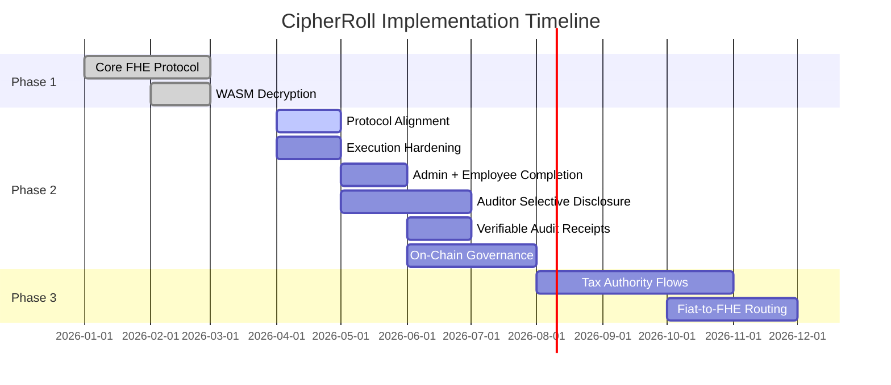

# CipherRoll Product Roadmap

CipherRoll is continuously evolving to support comprehensive enterprise payroll, auditing, and tax compliance needs.

## Phase 1: Core Privacy Protocol (Current)
- [x] Pure Fhenix/EVM project architecture
- [x] `CipherRollPayroll.sol` secure execution contract
- [x] Seamless EVM Wallet authentication
- [x] Homomorphic budgeting and deposit flows
- [x] Confidential payroll issuance (Push, Pull, and Vesting mechanics)
- [x] True client-side decryption via `@cofhe/sdk`
- [x] High-conversion UI/UX utilizing premium glassmorphism 

## Phase 2: Protocol Alignment, Portal Completion & Verifiable Privacy (Active)

Phase 2 is focused on one deliverable above all else: a fully working admin and employee experience built on the latest CoFHE workflow, deployed only on **Arbitrum Sepolia** or **Base Sepolia**, and backed by much stronger technical proof than Wave 1. Auditor selective-disclosure work is part of the same roadmap, but it should remain explicitly scoped as follow-on functionality until the contract and frontend support it for real.

**Priority 1: Protocol Alignment & Environment Truthfulness**
- **Retire legacy CoFHE client debt end-to-end:** Remove remaining legacy client dependencies from the contract tooling story, frontend copy, docs, and operational flows. Standardize on `@cofhe/sdk` and its explicit builder-pattern APIs (`encryptInputs`, `decryptForView`, `decryptForTx`).
- **Upgrade the root dev stack, not just the frontend:** Migrate testing and local development to the current CoFHE-compatible plugin/mock stack and pin versions that remain compatible with the active `@fhenixprotocol/cofhe-contracts` release.
- **Regenerate interfaces around the latest encrypted-handle model:** Rebuild ABIs, generated types, and deployment metadata around the current `bytes32` ciphertext-handle model so off-chain reads, decrypt flows, and mocks all agree.
- **Eliminate network hallucinations completely:** Ensure all runtime config, docs, deployment artifacts, and user-facing copy point only to **Arbitrum Sepolia** or **Base Sepolia**. No lingering Ethereum Sepolia / "Fhenix L2" ambiguity remains anywhere in the product.

**Priority 2: Technical Execution Hardening**
- **Make the proof layer credible:** Restore real automated tests for encrypted budget math, payroll issuance, vesting, access control, failure handling, and permit-enabled reads.
- **Require a clean engineering baseline:** `npm run test`, `npm run compile`, and the frontend production build must all pass consistently before any later Phase 2 milestone is considered complete.
- **Tighten the shipped product to match reality:** Remove stale UI and documentation fragments that overstate what is live, and replace placeholder behavior with explicit, testable system behavior.

**Priority 3: Admin & Employee Portal Completion**
- **Finish the admin portal as an operator-grade surface:** Workspace creation, encrypted budget funding, payroll issuance, organization refresh, and clear failure states must all work smoothly on the supported CoFHE testnets.
- **Finish the employee portal as a trustworthy self-service surface:** Permit creation, allocation retrieval, decryption, vesting visibility, and claim state must be stable and understandable without hidden manual steps.
- **Make vesting and employee self-service meaningfully complete:** Employees should be able to understand whether an allocation is instant, vesting-locked, or claimable, and the claim path must reflect real contract behavior rather than placeholder UX.
- **Ship privacy-safe operator insight instead of raw tables:** Add aggregate-only admin analytics for budget health, committed payroll, available runway, payment counts, and other organization-level metrics without exposing employee-level salary rows.
- **Remove Wave 1 scaffolding that weakens the story:** Strip out stale treasury-route guidance, dummy downloads, and other leftover mock concepts that distract from the real encrypted payroll workflow.

**Priority 4: Auditor Portal via Permit-Aware Contract Architecture**
- **Do not rely on shared permits alone:** Introduce contract-side auditor read flows designed specifically for shared-permit access, rather than assuming `msg.sender`-restricted admin getters can be reused.
- **Keep disclosure minimal and role-specific:** Auditor access should be limited to organization-level aggregates, policy checks, and compliance-safe summaries, never raw employee salary handles or unnecessary PII.
- **Make auditor reporting explicitly aggregate-first:** Auditor workflows should center on solvency summaries, recipient counts, pay-period commitments, and policy checks rather than employee-level payroll history.
- **Use explicit selective-disclosure controls:** Shared permits should be short-lived, scoped, revocable, and backed by `validatorId` / `validatorContract`-style validity controls plus on-chain validity checks where appropriate.

**Priority 5: Verifiable Disclosure & Audit Receipts**
- **Promote selective disclosure from "viewable" to "provable":** Use `decryptForTx` and `FHE.publishDecryptResult` / `FHE.verifyDecryptResult` for disclosures that must produce cryptographically defensible compliance evidence.
- **Support batched evidence flows:** Auditor-facing summaries and later compliance reports should be able to produce signed, verifiable aggregate disclosures without exposing the underlying employee-level state.

**Priority 6: Real On-Chain Governance (M-of-N Admins)**
- **Turn reserved quorum metadata into real enforcement:** Upgrade the protocol from a single-admin execution model into actual M-of-N admin approval with proposal hashing, approval state tracking, threshold checks, and controlled execution.
- **Keep governance on-chain, not cosmetic:** The goal is not a frontend queue of approvals; it is true on-chain execution gating that judges can recognize as substantive technical governance.

**Priority 7: Optional ReineiraOS Compliance Integration**
- **Treat ReineiraOS as an extension, not a dependency for core readiness:** Integrate `@reineira-os/sdk` only after the CoFHE migration, portal completion, and engineering hardening are stable.
- **Use it for optional resolver/compliance workflows:** It can strengthen later compliance automation, but it should not pull the core CipherRoll architecture back into legacy patterns while Phase 2 is still establishing protocol correctness.

**Non-Blocking Watch Item**
- **Track deeper CoFHE infrastructure changes without derailing delivery:** We will monitor evolving infrastructure such as commitment-oriented integrity tooling, but direct integration is not a Phase 2 blocker unless it becomes necessary for supported app-level workflows.

## Phase 3: Total Compliance Integration
- **Tax Authority Workflows:** Automated, FHE-encrypted tax withholding and provisioning paths that grant visibility strictly to mapped government addresses.
- **Advanced Treasury Analytics:** Expanding the dashboard to include cross-chain flow analysis while preserving specific PII privacy.
- **Expanded Aggregate-Only Analytics:** Extend the Phase 2 admin insight model into richer organization-level reporting without exposing employee-level salary data or unnecessary personal metadata.
- **Automated Fiat On-Ramps:** Frictionless payroll settlement where organizations deposit fiat, auto-convert to encrypted stablecoins, and distribute on-chain.

