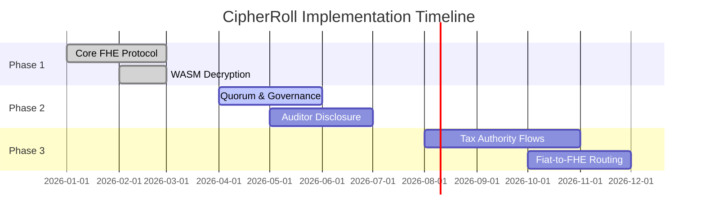

# CipherRoll Product Roadmap

CipherRoll is continuously evolving to support comprehensive enterprise payroll, auditing, and tax compliance needs.

## Phase 1: Core Privacy Protocol (Current)
- [x] Pure Fhenix/EVM project architecture
- [x] `CipherRollPayroll.sol` secure execution contract
- [x] Seamless EVM Wallet authentication
- [x] Homomorphic budgeting and deposit flows
- [x] Confidential payroll issuance (Push, Pull, and Vesting mechanics)
- [x] True Client-Side WASM decryption via `cofhejs`
- [x] High-conversion UI/UX utilizing premium glassmorphism 

## Phase 2: Decentralized Governance & Auditing
- **True M-of-N Execution:** Transforming reserved governance fields into strict multisig logic for large-scale treasury actions.
- **Auditor Selective Disclosure:** Allowing administrators to cryptographically issue temporary decryption permits to external auditors for quarterly analysis.
- **Deep Treasury Adapters:** Native integration with Privara-backed stablecoin settlement depth across Ethereum L2s.

## Phase 3: Total Compliance Integration
- **Tax Authority Workflows:** Automated, FHE-encrypted tax withholding and provisioning paths that grant visibility strictly to mapped government addresses.
- **Advanced Treasury Analytics:** Expanding the dashboard to include cross-chain flow analysis while preserving specific PII privacy.
- **Automated Fiat On-Ramps:** Frictionless payroll settlement where organizations deposit fiat, auto-convert to encrypted stablecoins, and distribute on-chain.

